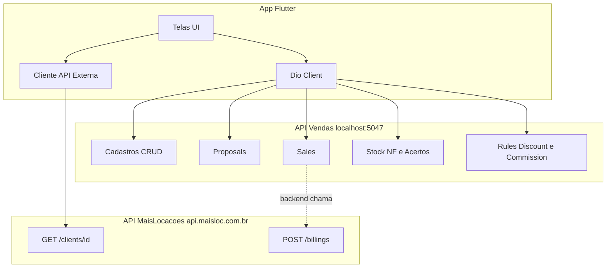

# Referência de APIs e DTOs — Sales MVP

Documentação completa dos endpoints REST, DTOs e integrações externas do microserviço de Vendas. Destinada ao desenvolvimento do frontend Flutter e integrações.

> **Base URL (dev):** `http://localhost:5047`  
> **Swagger:** `/swagger` (Development)  
> **Autenticação:** JWT Bearer em todas as rotas (exceto health se existir)

---

## Índice

1. [Convenções gerais](#convenções-gerais)
2. [Autenticação JWT](#autenticação-jwt)
3. [Respostas de erro](#respostas-de-erro)
4. [Enums](#enums)
5. [BaseDTO e auditoria](#basedto-e-auditoria)
6. [Catálogo de endpoints](#catálogo-de-endpoints)
7. [DTOs por módulo](#dtos-por-módulo)
8. [APIs externas (MaisLocações)](#apis-externas-maislocações)
9. [Fluxos de integração — sequência de chamadas](#fluxos-de-integração--sequência-de-chamadas)

---

## Convenções gerais

| Item | Valor |
|------|-------|
| Formato | JSON |
| Serialização | **camelCase** (padrão ASP.NET Core) |
| Content-Type request | `application/json` |
| Content-Type response | `application/json` |
| Rota controllers | `[controller]` → nome plural PascalCase (`/Products`, `/Proposals`) |
| IDs | `int` |
| Decimais | `number` (JSON) — moeda e quantidade |
| Datas | ISO 8601 (`2026-08-17T10:00:00`) |
| Enums | número (`1`, `2`, …) ou string (ambos aceitos pelo ASP.NET Core) |
| Multi-tenant | CNPJ no claim JWT → banco `microservices_{CNPJ}` |

### Headers obrigatórios

```http
Authorization: Bearer {jwt_token}
Content-Type: application/json
```

### Códigos HTTP utilizados

| Código | Uso |
|--------|-----|
| 200 | OK — GET, PUT, PATCH, ações POST (send, approve, confirm) |
| 201 | Created — POST create, convert-to-sale |
| 204 | No Content — DELETE |
| 400 | Bad Request — regra de negócio (`CustomBusinessException`) |
| 401 | Unauthorized — token ausente/inválido/expirado |
| 404 | Not Found — registro não encontrado (alguns casos via 400) |
| 500 | Internal Server Error |

---

## Autenticação JWT

Validação via `TokenValidationAttribute` + `JwtHelper`. Algoritmo: **HS256**.

### Claims utilizados pelo backend

| Claim | Uso |
|-------|-----|
| `email` | Vendedor, auditoria CreatedBy/UpdatedBy, regras desconto |
| `cnpj` | Tenant — roteamento do banco de dados |
| `role` | Regras de desconto (limite por perfil) |
| `timeZone` | Conversão de datas (default `America/Sao_Paulo`) |
| `unique_name` | Nome do usuário |
| `cpf` | Disponível (opcional) |

---

## Respostas de erro

### ExceptionResponseDTO

```json
{
  "date": "2026-08-17T22:30:00",
  "errors": [
    { "message": "Ops... Estoque insuficiente para o produto Betoneira 400L." }
  ]
}
```

| Campo | Tipo | Descrição |
|-------|------|-----------|
| date | datetime | Momento do erro |
| errors | array | Lista de mensagens |
| errors[].message | string | Mensagem em português (pode conter `\|` para múltiplas) |

---

## Enums

### SaleTypeEnum

| Valor | Nome | Label UI |
|-------|------|----------|
| 1 | Internal | Interna |
| 2 | ThirdParty | Terceiros |

### ProposalStatusEnum

| Valor | Nome | Label UI |
|-------|------|----------|
| 1 | Draft | Rascunho |
| 2 | Sent | Enviada |
| 3 | Approved | Aprovada |
| 4 | Rejected | Rejeitada |
| 5 | Converted | Convertida |
| 6 | Cancelled | Cancelada |

### SaleStatusEnum

| Valor | Nome | Label UI |
|-------|------|----------|
| 1 | Pending | Pendente |
| 2 | Confirmed | Confirmada |

### PurchaseEntryStatusEnum

| Valor | Nome | Label UI |
|-------|------|----------|
| 1 | Draft | Rascunho |
| 2 | Confirmed | Confirmada |

### CommissionStatusEnum

| Valor | Nome | Label UI |
|-------|------|----------|
| 1 | Pending | Pendente |
| 2 | Paid | Paga |

### CommissionCalculationScopeEnum

| Valor | Nome | Label UI |
|-------|------|----------|
| 1 | PerSale | Por venda (linha única) |
| 2 | PerItem | Por item |

### DiscountScopeEnum

| Valor | Nome | Label UI |
|-------|------|----------|
| 1 | Item | Item |
| 2 | Document | Documento |

### StockMovementTypeEnum

| Valor | Nome | Label UI |
|-------|------|----------|
| 1 | PurchaseIn | Entrada NF |
| 2 | SaleOut | Saída venda |
| 3 | AdjustmentIn | Acerto entrada |
| 4 | AdjustmentOut | Acerto saída |

---

## BaseDTO e auditoria

Campos presentes em **todos os ResponseDTO** que estendem `BaseDTO`:

| Campo | Tipo | Descrição |
|-------|------|-----------|
| createdAt | datetime | Data criação |
| createdBy | string | Email JWT |
| updatedAt | datetime? | Data última alteração |
| updatedBy | string? | Email JWT |

---

## Catálogo de endpoints

### UnitOfMeasures

| Método | Path | Request | Response | Status |
|--------|------|---------|----------|--------|
| GET | `/UnitOfMeasures` | — | `UnitOfMeasureResponseDTO[]` | 200 |
| GET | `/UnitOfMeasures/{id}` | — | `UnitOfMeasureResponseDTO` | 200 |
| POST | `/UnitOfMeasures` | `CreateUnitOfMeasureRequestDTO` | `UnitOfMeasureResponseDTO` | 201 |
| PUT | `/UnitOfMeasures/{id}` | `UpdateUnitOfMeasureRequestDTO` | `UnitOfMeasureResponseDTO` | 200 |
| DELETE | `/UnitOfMeasures/{id}` | — | — | 204 |

---

### Products

| Método | Path | Request | Response | Status |
|--------|------|---------|----------|--------|
| GET | `/Products` | — | `ProductResponseDTO[]` | 200 |
| GET | `/Products/{id}` | — | `ProductResponseDTO` | 200 |
| GET | `/Products/{id}/stock-summary` | — | `ProductStockSummaryResponseDTO` | 200 |
| GET | `/Products/{id}/stock-movements` | — | `StockMovementResponseDTO[]` | 200 |
| POST | `/Products` | `CreateProductRequestDTO` | `ProductResponseDTO` | 201 |
| PUT | `/Products/{id}` | `UpdateProductRequestDTO` | `ProductResponseDTO` | 200 |
| DELETE | `/Products/{id}` | — | — | 204 |

---

### Suppliers

| Método | Path | Request | Response | Status |
|--------|------|---------|----------|--------|
| GET | `/Suppliers` | — | `SupplierResponseDTO[]` | 200 |
| GET | `/Suppliers/{id}` | — | `SupplierResponseDTO` | 200 |
| POST | `/Suppliers` | `CreateSupplierRequestDTO` | `SupplierResponseDTO` | 201 |
| PUT | `/Suppliers/{id}` | `UpdateSupplierRequestDTO` | `SupplierResponseDTO` | 200 |
| DELETE | `/Suppliers/{id}` | — | — | 204 |

---

### PaymentConditions

| Método | Path | Request | Response | Status |
|--------|------|---------|----------|--------|
| GET | `/PaymentConditions` | — | `PaymentConditionResponseDTO[]` | 200 |
| GET | `/PaymentConditions/{id}` | — | `PaymentConditionResponseDTO` | 200 |
| POST | `/PaymentConditions` | `CreatePaymentConditionRequestDTO` | `PaymentConditionResponseDTO` | 201 |
| PUT | `/PaymentConditions/{id}` | `UpdatePaymentConditionRequestDTO` | `PaymentConditionResponseDTO` | 200 |
| DELETE | `/PaymentConditions/{id}` | — | — | 204 |

---

### CommissionRules

| Método | Path | Request | Response | Status |
|--------|------|---------|----------|--------|
| GET | `/CommissionRules` | — | `CommissionRuleResponseDTO[]` | 200 |
| GET | `/CommissionRules/{id}` | — | `CommissionRuleResponseDTO` | 200 |
| POST | `/CommissionRules` | `CreateCommissionRuleRequestDTO` | `CommissionRuleResponseDTO` | 201 |
| PUT | `/CommissionRules/{id}` | `UpdateCommissionRuleRequestDTO` | `CommissionRuleResponseDTO` | 200 |
| DELETE | `/CommissionRules/{id}` | — | — | 204 |

---

### DiscountRules

| Método | Path | Request | Response | Status |
|--------|------|---------|----------|--------|
| GET | `/DiscountRules` | — | `DiscountRuleResponseDTO[]` | 200 |
| GET | `/DiscountRules/{id}` | — | `DiscountRuleResponseDTO` | 200 |
| POST | `/DiscountRules` | `CreateDiscountRuleRequestDTO` | `DiscountRuleResponseDTO` | 201 |
| PUT | `/DiscountRules/{id}` | `UpdateDiscountRuleRequestDTO` | `DiscountRuleResponseDTO` | 200 |
| DELETE | `/DiscountRules/{id}` | — | — | 204 |

---

### ProductPurchaseEntries

| Método | Path | Request | Response | Status |
|--------|------|---------|----------|--------|
| GET | `/ProductPurchaseEntries` | — | `ProductPurchaseEntryResponseDTO[]` | 200 |
| GET | `/ProductPurchaseEntries/{id}` | — | `ProductPurchaseEntryResponseDTO` | 200 |
| POST | `/ProductPurchaseEntries` | `CreateProductPurchaseEntryRequestDTO` | `ProductPurchaseEntryResponseDTO` | 201 |
| PUT | `/ProductPurchaseEntries/{id}` | `UpdateProductPurchaseEntryRequestDTO` | `ProductPurchaseEntryResponseDTO` | 200 |
| DELETE | `/ProductPurchaseEntries/{id}` | — | — | 204 |
| POST | `/ProductPurchaseEntries/{id}/confirm` | — | `ProductPurchaseEntryResponseDTO` | 200 |

> Confirmar: irreversível. Atualiza estoque, custo (maior NF), preço venda.

---

### StockAdjustments

| Método | Path | Request | Response | Status |
|--------|------|---------|----------|--------|
| GET | `/StockAdjustments` | — | `StockAdjustmentResponseDTO[]` | 200 |
| GET | `/StockAdjustments/{id}` | — | `StockAdjustmentResponseDTO` | 200 |
| POST | `/StockAdjustments` | `CreateStockAdjustmentRequestDTO` | `StockAdjustmentResponseDTO` | 201 |
| PUT | `/StockAdjustments/{id}` | `UpdateStockAdjustmentRequestDTO` | `StockAdjustmentResponseDTO` | 200 |
| DELETE | `/StockAdjustments/{id}` | — | — | 204 |
| POST | `/StockAdjustments/{id}/confirm` | — | `StockAdjustmentResponseDTO` | 200 |

---

### Proposals

| Método | Path | Request | Response | Status |
|--------|------|---------|----------|--------|
| GET | `/Proposals` | — | `ProposalResponseDTO[]` | 200 |
| GET | `/Proposals/{id}` | — | `ProposalResponseDTO` | 200 |
| POST | `/Proposals` | `CreateProposalRequestDTO` | `ProposalResponseDTO` | 201 |
| PUT | `/Proposals/{id}` | `UpdateProposalRequestDTO` | `ProposalResponseDTO` | 200 |
| DELETE | `/Proposals/{id}` | — | — | 204 |
| POST | `/Proposals/{id}/send` | — | `ProposalResponseDTO` | 200 |
| POST | `/Proposals/{id}/approve` | — | `ProposalResponseDTO` | 200 |
| POST | `/Proposals/{id}/convert-to-sale` | — | `SaleResponseDTO` | 201 |

**Regras:**
- PUT/DELETE: somente status `Draft`
- send: `Draft` → `Sent` (gera número se vazio)
- approve: `Sent` → `Approved`
- convert: `Approved` → cria venda confirmada + `Converted`

---

### Sales

| Método | Path | Request | Response | Status |
|--------|------|---------|----------|--------|
| GET | `/Sales` | Query (opcional, ver abaixo) | `SaleResponseDTO[]` | 200 |
| GET | `/Sales/{id}` | — | `SaleResponseDTO` | 200 |
| POST | `/Sales` | `CreateSaleRequestDTO` | `SaleResponseDTO` | 201 |
| POST | `/Sales/{id}/confirm` | — | `SaleResponseDTO` | 200 |

> **Status:** `GET /Sales` está **documentado e previsto** para a lista de vendas no Flutter; **implementação pendente** no backend (demais rotas já existem).

#### GET /Sales — query parameters (opcionais)

| Parâmetro | Tipo | Descrição |
|-----------|------|-----------|
| status | int | `SaleStatusEnum`: 1=Pendente, 2=Confirmada |
| saleType | int | `SaleTypeEnum`: 1=Interna, 2=Terceiros |
| soldAtFrom | datetime | Início do período (`soldAt`) |
| soldAtTo | datetime | Fim do período (`soldAt`) |
| externalClientId | string | Filtro por cliente externo |
| sellerEmail | string | Filtro por vendedor (default JWT no app: minhas vendas) |
| hasProposal | bool | `true` = originadas de proposta; `false` = venda direta |
| number | string | Busca parcial pelo número (`2026/000001`) |

**Exemplo:**
```http
GET /Sales?status=2&saleType=2&sellerEmail=vendedor@empresa.com
Authorization: Bearer {token}
```

**Response 200:**
```json
[
  {
    "id": 1,
    "number": "2026/000001",
    "proposalId": null,
    "externalClientId": "CLIENT-001",
    "externalBillingId": "BILLING-123",
    "sellerEmail": "vendedor@empresa.com",
    "paymentConditionId": 1,
    "saleType": 2,
    "status": 2,
    "soldAt": "2026-08-17T22:30:00",
    "subtotalAmount": 1560.00,
    "discountAmount": 0.00,
    "taxAmount": 265.20,
    "commissionAmount": 78.00,
    "totalAmount": 1825.20,
    "items": [],
    "createdAt": "2026-08-17T22:30:00",
    "createdBy": "vendedor@empresa.com",
    "updatedAt": null,
    "updatedBy": null
  }
]
```

> **Nota implementação backend:** retorno pode omitir `items[]` na listagem para performance; o detalhe continua em `GET /Sales/{id}` com itens completos.

---

### Discounts

| Método | Path | Request | Response | Status |
|--------|------|---------|----------|--------|
| POST | `/Discounts/apply` | `ApplyDiscountRequestDTO` | `DiscountResponseDTO` | 200 |
| GET | `/Discounts/proposal/{proposalId}` | — | `DiscountResponseDTO[]` | 200 |
| GET | `/Discounts/sale/{saleId}` | — | `DiscountResponseDTO[]` | 200 |

---

### Commissions

| Método | Path | Request | Response | Status |
|--------|------|---------|----------|--------|
| GET | `/Commissions/sale/{saleId}` | — | `CommissionResponseDTO[]` | 200 |
| PATCH | `/Commissions/{id}/status` | `UpdateCommissionStatusRequestDTO` | `CommissionResponseDTO` | 200 |

---

## DTOs por módulo

### UnitOfMeasure

**CreateUnitOfMeasureRequestDTO**
```json
{ "name": "string", "abbreviation": "string", "isActive": true }
```

**UpdateUnitOfMeasureRequestDTO** — mesmos campos (sem defaults)

**UnitOfMeasureResponseDTO** — BaseDTO + `id`, `name`, `abbreviation`, `isActive`

---

### Product

**CreateProductRequestDTO**
```json
{
  "unitOfMeasureId": 1,
  "name": "string",
  "sku": "string",
  "description": "string|null",
  "unitPrice": 0.00,
  "costPrice": 0.00,
  "markupPercent": 0.00,
  "icmsPercent": 0.00,
  "issPercent": 0.00,
  "pisPercent": 0.00,
  "cofinsPercent": 0.00,
  "isActive": true
}
```

**UpdateProductRequestDTO** — mesmos campos (sem defaults)

**ProductResponseDTO** — BaseDTO + todos os campos acima + `id`

**ProductStockSummaryResponseDTO**
```json
{
  "productId": 1,
  "physical": 50.00,
  "reserved": 5.00,
  "available": 45.00
}
```

**StockMovementResponseDTO** — BaseDTO +
```json
{
  "id": 1,
  "productId": 1,
  "movementType": 1,
  "quantity": 10.00,
  "balanceAfter": 50.00,
  "productPurchaseEntryItemId": null,
  "stockAdjustmentItemId": null,
  "saleId": null,
  "originDocumentNumber": "2026/000001",
  "notes": "string|null"
}
```

---

### Supplier

**CreateSupplierRequestDTO / UpdateSupplierRequestDTO**
```json
{
  "name": "string",
  "document": "string",
  "email": "string|null",
  "phone": "string|null",
  "address": "string|null",
  "city": "string|null",
  "state": "string|null",
  "zipCode": "string|null",
  "isActive": true
}
```

**SupplierResponseDTO** — BaseDTO + campos acima + `id`

---

### PaymentCondition

**CreatePaymentConditionRequestDTO / UpdatePaymentConditionRequestDTO**
```json
{
  "name": "string",
  "installmentCount": 3,
  "daysUntilFirstDue": 30,
  "daysBetweenInstallments": 30,
  "cashDiscountPercent": 5.00,
  "isActive": true
}
```

**PaymentConditionResponseDTO** — BaseDTO + campos acima + `id`

---

### CommissionRule

**CreateCommissionRuleRequestDTO / UpdateCommissionRuleRequestDTO**
```json
{
  "productId": null,
  "calculationScope": 1,
  "commissionPercent": 5.00,
  "isActive": true
}
```

| Campo | Regra |
|-------|-------|
| productId | `null` = regra global (obrigatório ter calculationScope) |
| productId | preenchido = regra por produto (só %) |
| calculationScope | Apenas na regra global: 1=PerSale, 2=PerItem |

**CommissionRuleResponseDTO** — BaseDTO + campos acima + `id`

---

### DiscountRule

**CreateDiscountRuleRequestDTO / UpdateDiscountRuleRequestDTO**
```json
{
  "role": "Employee|null",
  "userEmail": "user@email.com|null",
  "maxDiscountPercent": 10.00,
  "maxDiscountAmount": 500.00,
  "isActive": true
}
```

**DiscountRuleResponseDTO** — BaseDTO + campos acima + `id`

---

### ProductPurchaseEntry

**CreateProductPurchaseEntryRequestDTO / UpdateProductPurchaseEntryRequestDTO**
```json
{
  "supplierId": 1,
  "invoiceNumber": "123456",
  "invoiceSeries": "1",
  "invoiceKey": "string|null",
  "entryDate": "2026-08-17T10:00:00",
  "notes": "string|null",
  "items": [
    {
      "productId": 1,
      "quantity": 50.00,
      "unitCost": 1200.00,
      "markupPercent": 30.00
    }
  ]
}
```

**ProductPurchaseEntryItemResponseDTO** — BaseDTO +
```json
{
  "id": 1,
  "productId": 1,
  "quantity": 50.00,
  "unitCost": 1200.00,
  "markupPercent": 30.00,
  "calculatedUnitPrice": 1560.00,
  "totalCost": 60000.00
}
```

**ProductPurchaseEntryResponseDTO** — BaseDTO +
```json
{
  "id": 1,
  "number": "2026/000001",
  "supplierId": 1,
  "invoiceNumber": "123456",
  "invoiceSeries": "1",
  "invoiceKey": "string|null",
  "status": 1,
  "entryDate": "2026-08-17T10:00:00",
  "notes": "string|null",
  "items": [ "ProductPurchaseEntryItemResponseDTO[]" ]
}
```

---

### StockAdjustment

**CreateStockAdjustmentRequestDTO / UpdateStockAdjustmentRequestDTO**
```json
{
  "adjustmentDate": "2026-08-17T10:00:00",
  "reason": "Inventario|Perda|Correcao",
  "notes": "string|null",
  "items": [
    { "productId": 1, "quantity": -2.00, "notes": "string|null" }
  ]
}
```

> `quantity` positivo = entrada; negativo = saída

**StockAdjustmentItemResponseDTO** — BaseDTO + `id`, `productId`, `quantity`, `notes`

**StockAdjustmentResponseDTO** — BaseDTO + `id`, `number`, `adjustmentDate`, `reason`, `notes`, `isConfirmed`, `items[]`

---

### Proposal

**CreateProposalRequestDTO**
```json
{
  "externalClientId": "CLIENT-001",
  "paymentConditionId": 1,
  "saleType": 2,
  "validUntil": "2026-12-31T23:59:59",
  "notes": "string|null",
  "items": [
    {
      "productId": 1,
      "quantity": 2.00,
      "unitPrice": 1560.00,
      "discountPercent": 0.00,
      "discountAmount": 0.00,
      "icmsPercent": null,
      "issPercent": null,
      "pisPercent": null,
      "cofinsPercent": null
    }
  ]
}
```

**UpdateProposalRequestDTO** — cabeçalho + `items: UpdateProposalItemRequestDTO[]` (mesma estrutura de item)

**ProposalItemResponseDTO** — BaseDTO +
```json
{
  "id": 1,
  "productId": 1,
  "quantity": 2.00,
  "unitPrice": 1560.00,
  "discountPercent": 0.00,
  "discountAmount": 0.00,
  "lineSubtotal": 3120.00,
  "icmsPercent": 18.00,
  "icmsAmount": 561.60,
  "issPercent": 5.00,
  "issAmount": 156.00,
  "pisPercent": 1.65,
  "pisAmount": 51.48,
  "cofinsPercent": 7.60,
  "cofinsAmount": 237.12,
  "lineTotal": 3650.40,
  "stockUnavailable": false
}
```

**ProposalResponseDTO** — BaseDTO +
```json
{
  "id": 1,
  "number": "2026/000001",
  "externalClientId": "CLIENT-001",
  "sellerEmail": "vendedor@empresa.com",
  "paymentConditionId": 1,
  "saleType": 2,
  "status": 1,
  "validUntil": "2026-12-31T23:59:59",
  "subtotalAmount": 3120.00,
  "discountAmount": 0.00,
  "taxAmount": 530.40,
  "totalAmount": 3650.40,
  "hasStockWarning": false,
  "notes": "string|null",
  "items": [ "ProposalItemResponseDTO[]" ]
}
```

---

### Sale

**CreateSaleRequestDTO**
```json
{
  "proposalId": null,
  "externalClientId": "CLIENT-001",
  "paymentConditionId": 1,
  "saleType": 2,
  "items": [
    {
      "productId": 1,
      "quantity": 1.00,
      "unitPrice": 1560.00,
      "discountPercent": 0.00,
      "discountAmount": 0.00,
      "icmsPercent": 18.00,
      "issPercent": 5.00,
      "pisPercent": 1.65,
      "cofinsPercent": 7.60
    }
  ]
}
```

**SaleItemResponseDTO** — mesma estrutura tributária de ProposalItem (sem stockUnavailable)

**SaleResponseDTO** — BaseDTO +
```json
{
  "id": 1,
  "number": "2026/000001",
  "proposalId": 1,
  "externalClientId": "CLIENT-001",
  "externalBillingId": "BILLING-123",
  "sellerEmail": "vendedor@empresa.com",
  "paymentConditionId": 1,
  "saleType": 2,
  "status": 2,
  "soldAt": "2026-08-17T22:30:00",
  "subtotalAmount": 1560.00,
  "discountAmount": 0.00,
  "taxAmount": 265.20,
  "commissionAmount": 78.00,
  "totalAmount": 1825.20,
  "items": [ "SaleItemResponseDTO[]" ]
}
```

---

### Discount

**ApplyDiscountRequestDTO**
```json
{
  "scope": 2,
  "proposalId": 1,
  "saleId": null,
  "proposalItemId": null,
  "saleItemId": null,
  "discountPercent": 5.00,
  "discountAmount": 0.00
}
```

**DiscountResponseDTO** — BaseDTO +
```json
{
  "id": 1,
  "scope": 2,
  "proposalId": 1,
  "saleId": null,
  "proposalItemId": null,
  "saleItemId": null,
  "discountPercent": 5.00,
  "discountAmount": 0.00,
  "appliedAmount": 156.00,
  "authorizedBy": "vendedor@empresa.com",
  "authorizedRole": "Employee"
}
```

---

### Commission

**UpdateCommissionStatusRequestDTO**
```json
{ "status": 2 }
```

**CommissionResponseDTO** — BaseDTO +
```json
{
  "id": 1,
  "saleId": 1,
  "saleItemId": null,
  "calculationScope": 1,
  "sellerEmail": "vendedor@empresa.com",
  "commissionPercent": 5.00,
  "baseAmount": 1560.00,
  "commissionAmount": 78.00,
  "status": 1
}
```

---

## APIs externas (MaisLocações)

Configuração backend (`appsettings.json`):

```json
{
  "Domains": {
    "MaisLocacoesDomain": "https://api.maisloc.com.br"
  }
}
```

No Flutter, configurar URL base externa equivalente (env/flavor).

### GET Cliente

```http
GET {MaisLocacoesDomain}/clients/{externalClientId}
Authorization: Bearer {jwt_token}
```

**Response 200 — ExternalClientResponseDTO**
```json
{
  "id": "CLIENT-001",
  "name": "Cliente Exemplo LTDA",
  "document": "00000000000000",
  "isActive": true
}
```

| Campo | Tipo | Descrição |
|-------|------|-----------|
| id | string | Identificador externo |
| name | string | Razão social / nome |
| document | string | CNPJ/CPF |
| isActive | bool | Cliente ativo |

**Erros:** 404 cliente não encontrado  
**Fallback backend:** se API indisponível, retorna mock ativo

**Uso no app:** autocomplete cliente em proposta/venda; exibir nome no card

---

### POST Cobrança

Chamada feita **pelo backend** na confirmação da venda. O app **não chama diretamente** — apenas exibe `externalBillingId` retornado em `SaleResponseDTO`.

Referência do contrato:

```http
POST {MaisLocacoesDomain}/billings
Authorization: Bearer {jwt_token}
Content-Type: application/json
```

**Request — CreateExternalBillingRequestDTO**
```json
{
  "saleId": 1,
  "externalClientId": "CLIENT-001",
  "totalAmount": 1825.20,
  "sellerEmail": "vendedor@empresa.com",
  "saleNumber": "2026/000001"
}
```

**Response 200 — ExternalBillingResponseDTO**
```json
{
  "id": "BILLING-123",
  "status": "Pending"
}
```

**Fallback backend:** `MOCK-BILLING-{saleId}-{timestamp}`

---

## Fluxos de integração — sequência de chamadas

### Fluxo A — Setup inicial (cadastros + estoque)

| # | Método | Endpoint | DTO Request | DTO Response |
|---|--------|----------|-------------|--------------|
| 1 | POST | `/UnitOfMeasures` | CreateUnitOfMeasureRequestDTO | UnitOfMeasureResponseDTO |
| 2 | POST | `/Products` | CreateProductRequestDTO | ProductResponseDTO |
| 3 | POST | `/Suppliers` | CreateSupplierRequestDTO | SupplierResponseDTO |
| 4 | POST | `/PaymentConditions` | CreatePaymentConditionRequestDTO | PaymentConditionResponseDTO |
| 5 | POST | `/CommissionRules` | CreateCommissionRuleRequestDTO | CommissionRuleResponseDTO |
| 6 | POST | `/ProductPurchaseEntries` | CreateProductPurchaseEntryRequestDTO | ProductPurchaseEntryResponseDTO |
| 7 | POST | `/ProductPurchaseEntries/{id}/confirm` | — | ProductPurchaseEntryResponseDTO |
| 8 | GET | `/Products/{id}/stock-summary` | — | ProductStockSummaryResponseDTO |

---

### Fluxo B — Proposta até venda

| # | Método | Endpoint | DTO Request | DTO Response |
|---|--------|----------|-------------|--------------|
| 1 | GET | `{MaisLocacoes}/clients/{id}` | — | ExternalClientResponseDTO |
| 2 | GET | `/PaymentConditions` | — | PaymentConditionResponseDTO[] |
| 3 | GET | `/Products` | — | ProductResponseDTO[] |
| 4 | GET | `/Products/{id}/stock-summary` | — | ProductStockSummaryResponseDTO |
| 5 | POST | `/Proposals` | CreateProposalRequestDTO | ProposalResponseDTO |
| 6 | POST | `/Proposals/{id}/send` | — | ProposalResponseDTO |
| 7 | POST | `/Proposals/{id}/approve` | — | ProposalResponseDTO |
| 8 | POST | `/Proposals/{id}/convert-to-sale` | — | SaleResponseDTO |
| 9 | GET | `/Commissions/sale/{saleId}` | — | CommissionResponseDTO[] |

**Opcional — desconto antes de enviar:**
| POST | `/Discounts/apply` | ApplyDiscountRequestDTO | DiscountResponseDTO |
| GET | `/Discounts/proposal/{id}` | — | DiscountResponseDTO[] |

---

### Fluxo C — Venda direta

| # | Método | Endpoint | DTO Request | DTO Response |
|---|--------|----------|-------------|--------------|
| 1 | GET | `{MaisLocacoes}/clients/{id}` | — | ExternalClientResponseDTO |
| 2 | GET | `/Products/{id}/stock-summary` | — | ProductStockSummaryResponseDTO |
| 3 | POST | `/Sales` | CreateSaleRequestDTO | SaleResponseDTO (Pending) |
| 4 | POST | `/Sales/{id}/confirm` | — | SaleResponseDTO (Confirmed) |
| 5 | GET | `/Commissions/sale/{saleId}` | — | CommissionResponseDTO[] |

**Consulta lista de vendas (tela /sales):**
| GET | `/Sales` | Query opcional (status, saleType, etc.) | SaleResponseDTO[] |

---

### Fluxo D — Acerto de estoque

| # | Método | Endpoint | DTO Request | DTO Response |
|---|--------|----------|-------------|--------------|
| 1 | GET | `/Products` | — | ProductResponseDTO[] |
| 2 | GET | `/Products/{id}/stock-summary` | — | ProductStockSummaryResponseDTO |
| 3 | POST | `/StockAdjustments` | CreateStockAdjustmentRequestDTO | StockAdjustmentResponseDTO |
| 4 | POST | `/StockAdjustments/{id}/confirm` | — | StockAdjustmentResponseDTO |
| 5 | GET | `/Products/{id}/stock-movements` | — | StockMovementResponseDTO[] |

---

### Fluxo E — Consulta produto (detalhe completo)

| # | Método | Endpoint | Response |
|---|--------|----------|----------|
| 1 | GET | `/Products/{id}` | ProductResponseDTO |
| 2 | GET | `/Products/{id}/stock-summary` | ProductStockSummaryResponseDTO |
| 3 | GET | `/Products/{id}/stock-movements` | StockMovementResponseDTO[] |

---

## Diagrama — integração app ↔ APIs



---

*Referências: [`sales-mvp-model.md`](sales-mvp-model.md), [`flutter-ui-spec.md`](flutter-ui-spec.md), [`postman/Sales-MVP-Full-Flow.postman_collection.json`](postman/Sales-MVP-Full-Flow.postman_collection.json)*
