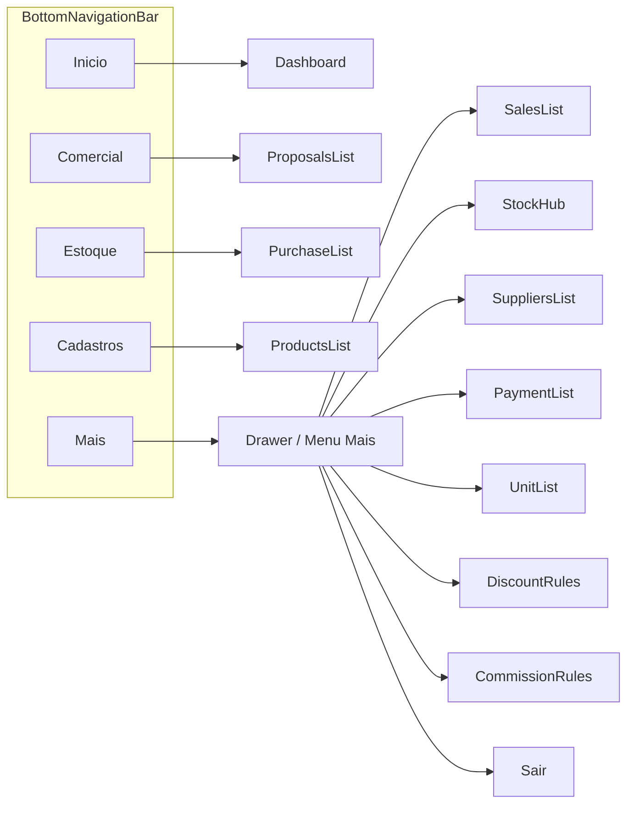
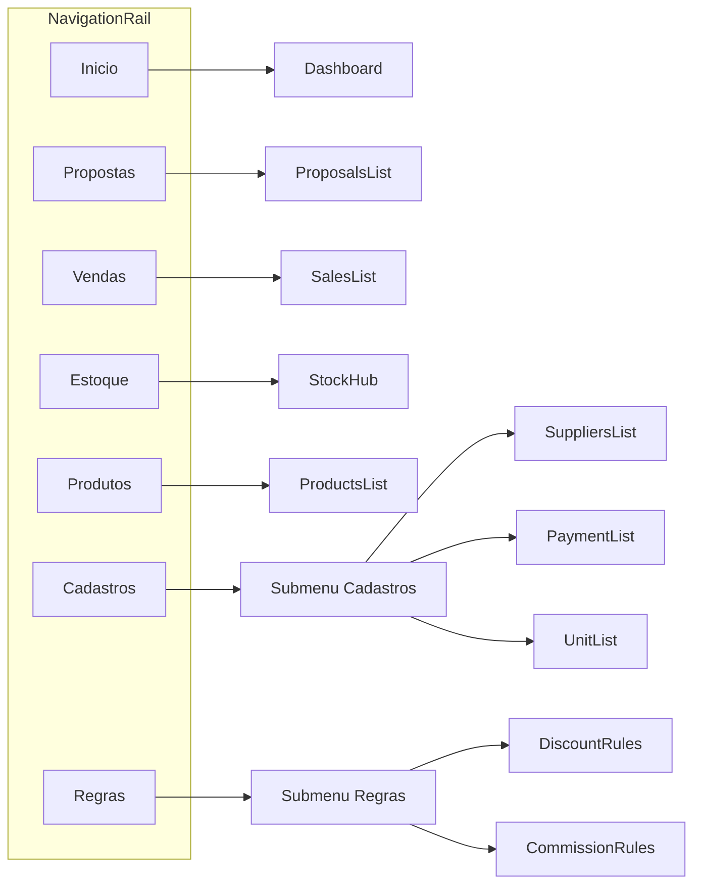
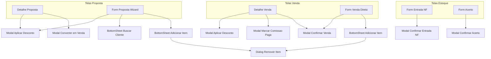
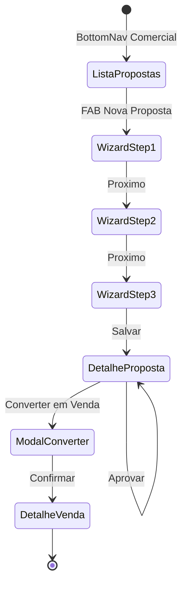
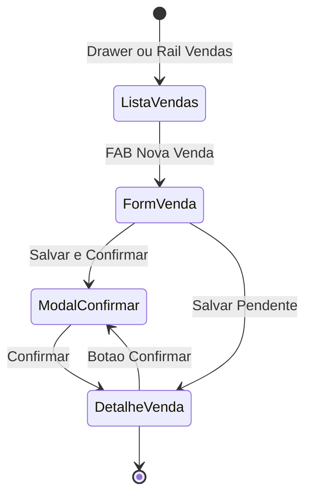
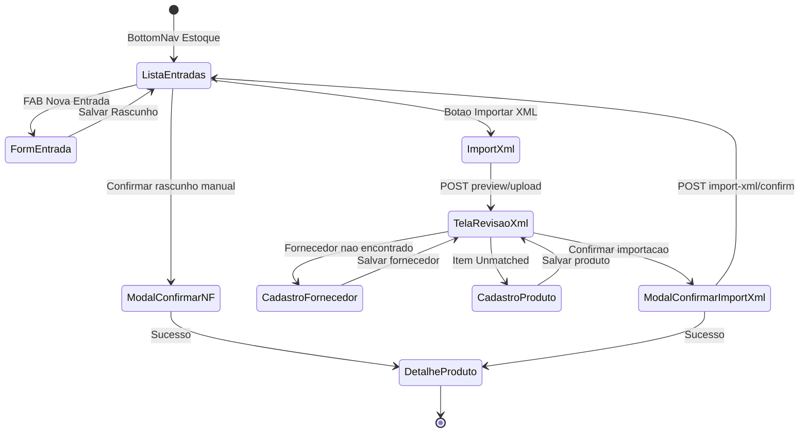

# Especificação de Telas — App Vendas (Flutter Mobile + Web)

Documento de referência para desenvolvimento do frontend Flutter. Baseado no MVP implementado no BackendTemplate e na modelagem em [`sales-mvp-model.md`](sales-mvp-model.md).

> **Referência completa de APIs e DTOs:** [`api-reference-sales-mvp.md`](api-reference-sales-mvp.md) — catálogo de endpoints, verbos HTTP, request/response, enums e integrações externas (MaisLocações).

> **Plataforma alvo:** Flutter (Android, iOS, Web) — **mobile-first**, layout responsivo para web.
> **Backend:** API REST autenticada via JWT Bearer.
> **Tenant:** multi-empresa por CNPJ no token.
> **Cliente externo:** consulta via API MaisLocações (`GET /clients/{id}`).

---

## Índice

1. [Visão geral](#visão-geral)
2. [Princípios de UX](#princípios-de-ux)
3. [Autenticação e sessão](#autenticação-e-sessão)
4. [Navegação global](#navegação-global)
   - [Diagrama de navegação (Sitemap)](#diagrama-de-navegação-sitemap)
5. [Dashboard (Home)](#dashboard-home)
6. [Módulo Comercial](#módulo-comercial)
7. [Módulo Estoque](#módulo-estoque)
8. [Módulo Cadastros](#módulo-cadastros)
9. [Módulo Regras](#módulo-regras)
10. [Componentes reutilizáveis](#componentes-reutilizáveis)
11. [Modais e confirmações](#modais-e-confirmações)
12. [Estados visuais e feedback](#estados-visuais-e-feedback)
13. [Fluxos principais (jornadas)](#fluxos-principais-jornadas)
14. [Mapeamento tela → API](#mapeamento-tela--api)
15. [Referência API e DTOs (documento dedicado)](#referência-api-e-dtos-documento-dedicado)
16. [Prompt base para desenvolvimento Flutter](#prompt-base-para-desenvolvimento-flutter)

---

## Visão geral

### Objetivo do app

Aplicativo de **vendas e estoque** para vendedores e gestores de locação/comercialização. Permite:

- Cadastrar produtos, fornecedores e condições comerciais
- Controlar estoque (entrada NF, acertos, movimentações)
- Criar propostas comerciais e convertê-las em vendas
- Registrar vendas diretas
- Aplicar descontos conforme regras do usuário
- Consultar comissões geradas

### Personas

| Persona | Uso principal |
|---------|---------------|
| **Vendedor** | Propostas, vendas, consulta estoque, clientes |
| **Gestor/Estoque** | Entradas NF, acertos, cadastros |
| **Admin** | Regras de desconto/comissão, todos os cadastros |

### Fora do escopo MVP (não implementar telas)

- Cancelamento de venda
- Cancelamento de entrada NF
- Multi-depósito
- Estorno de cobrança
- Cadastro de clientes (vem da API externa)

---

## Princípios de UX

### Mobile-first

- Telas pensadas para **uma mão**, thumb zone inferior para ações primárias
- Formulários longos em **steps/wizard** ou seções colapsáveis
- Listas com **pull-to-refresh** e scroll infinito (se paginação futura)
- Campos numéricos com teclado decimal
- Botões flutuantes (FAB) para ações de criação nas listas

### Web (responsive)

- Breakpoint ≥ 900px: **NavigationRail** lateral + conteúdo amplo
- Breakpoint < 900px: mesmo layout mobile (BottomNavigationBar)
- Listas em **tabela** na web; **cards** no mobile
- Formulários em **2 colunas** na web quando couber

### Padrões gerais

- **AppBar** com título, botão voltar, ações contextuais (filtro, busca)
- **Empty state** ilustrado + CTA quando lista vazia
- **Skeleton/shimmer** durante loading
- **SnackBar** para sucesso; **Dialog** para erros bloqueantes
- Valores monetários: `R$ 1.234,56` (locale pt_BR)
- Datas: `dd/MM/yyyy HH:mm`
- Documentos: exibir número `2026/000042` em destaque

---

## Autenticação e sessão

### Tela: Login

| Campo | Tipo | Obrigatório |
|-------|------|-------------|
| Email | email | Sim |
| Senha | password | Sim |

**Ações:**
- Entrar → obtém JWT (integração com serviço de auth existente da MaisLocações)
- Persistir token em secure storage (mobile) / localStorage criptografado (web)

**Pós-login:** decodificar JWT e exibir no header:
- Nome (`unique_name`)
- Empresa (CNPJ formatado)
- Avatar/iniciais

**Estados:**
- Loading no botão Entrar
- Erro: credenciais inválidas / token expirado

> O backend de vendas **não possui endpoint de login** — o app consome o auth externo e repassa o JWT nas chamadas.

---

## Navegação global

### Mobile — Bottom Navigation (5 abas)

| Aba | Ícone | Destino |
|-----|-------|---------|
| Início | home | Dashboard |
| Comercial | handshake / cart | Propostas (default) |
| Estoque | inventory | Entradas NF (default) |
| Cadastros | category | Produtos (default) |
| Mais | menu | Drawer com Regras, Fornecedores, Condições, Unidades, Perfil |

### Web — NavigationRail (expandido)

```
┌──────────┬─────────────────────────────────────┐
│  Logo    │  AppBar: título + busca + perfil    │
├──────────┼─────────────────────────────────────┤
│ Início   │                                     │
│ Propostas│         Conteúdo                    │
│ Vendas   │                                     │
│ Estoque  │                                     │
│ Produtos │                                     │
│ Cadastros│                                     │
│ Regras   │                                     │
└──────────┴─────────────────────────────────────┘
```

### Drawer / Menu "Mais"

- Fornecedores
- Condições de pagamento
- Unidades de medida
- Regras de desconto
- Regras de comissão
- Sair

---

### Diagrama de navegação (Sitemap)

Visão completa de rotas, hierarquia e modais sobrepostos.

#### Sitemap geral (todas as telas)

```mermaid
flowchart TD
    Login["/login — Login"]

    Login --> Dashboard["/ — Dashboard"]

    Dashboard --> ProposalsList["/proposals — Lista Propostas"]
    Dashboard --> SalesList["/sales — Lista Vendas"]
    Dashboard --> StockHub["/stock — Hub Estoque"]
    Dashboard --> ProductsList["/products — Lista Produtos"]

    subgraph Comercial["Modulo Comercial"]
        ProposalsList --> ProposalNew["/proposals/new — Wizard Proposta"]
        ProposalsList --> ProposalDetail["/proposals/:id — Detalhe Proposta"]
        ProposalDetail --> ProposalEdit["/proposals/:id/edit — Editar Proposta"]
        ProposalDetail --> SaleFromProposal["/sales/:id — Detalhe Venda"]
        SalesList --> SaleNew["/sales/new — Venda Direta"]
        SalesList --> SaleDetail["/sales/:id — Detalhe Venda"]
    end

    subgraph Estoque["Modulo Estoque"]
        StockHub --> PurchaseList["/stock/purchase-entries — Entradas NF"]
        StockHub --> AdjustmentList["/stock/adjustments — Acertos"]
        PurchaseList --> PurchaseNew["/stock/purchase-entries/new — Form NF"]
        PurchaseList --> PurchaseEdit["/stock/purchase-entries/:id/edit"]
        AdjustmentList --> AdjustmentNew["/stock/adjustments/new — Form Acerto"]
    end

    subgraph Cadastros["Modulo Cadastros"]
        ProductsList --> ProductNew["/products/new — Novo Produto"]
        ProductsList --> ProductDetail["/products/:id — Detalhe Produto"]
        ProductDetail --> ProductStock["Aba Estoque e Movimentacoes"]
        ProductsList --> SuppliersList["/suppliers — Fornecedores"]
        SuppliersList --> SupplierForm["/suppliers/new | :id/edit"]
        ProductsList --> PaymentList["/payment-conditions — Condicoes"]
        PaymentList --> PaymentForm["/payment-conditions/new"]
        ProductsList --> UnitList["/unit-of-measures — Unidades"]
    end

    subgraph Regras["Modulo Regras"]
        DiscountRules["/rules/discounts — Regras Desconto"]
        CommissionRules["/rules/commissions — Regras Comissao"]
    end

    Dashboard --> DiscountRules
    Dashboard --> CommissionRules
```



#### Mobile — Bottom Navigation



#### Web — NavigationRail (≥ 900px)



#### Modais e BottomSheets (camada sobre telas)



#### Fluxo de telas — Proposta até Venda



#### Fluxo de telas — Venda direta



#### Fluxo de telas — Entrada NF



#### Mapa de rotas go_router (referência)

| Rota | Nome | Tela |
|------|------|------|
| `/login` | login | Login |
| `/` | home | Dashboard |
| `/proposals` | proposals | Lista Propostas |
| `/proposals/new` | proposal-new | Wizard Proposta |
| `/proposals/:id` | proposal-detail | Detalhe Proposta |
| `/proposals/:id/edit` | proposal-edit | Editar Proposta |
| `/sales` | sales | Lista Vendas |
| `/sales/new` | sale-new | Venda Direta |
| `/sales/:id` | sale-detail | Detalhe Venda |
| `/stock` | stock | Hub Estoque |
| `/stock/purchase-entries` | purchase-list | Entradas NF |
| `/stock/purchase-entries/new` | purchase-new | Form NF |
| `/stock/purchase-entries/:id/edit` | purchase-edit | Editar NF |
| `/stock/adjustments` | adjustment-list | Acertos |
| `/stock/adjustments/new` | adjustment-new | Form Acerto |
| `/products` | products | Lista Produtos |
| `/products/new` | product-new | Novo Produto |
| `/products/:id` | product-detail | Detalhe Produto |
| `/suppliers` | suppliers | Fornecedores |
| `/suppliers/new` | supplier-new | Novo Fornecedor |
| `/suppliers/:id/edit` | supplier-edit | Editar Fornecedor |
| `/payment-conditions` | payment-conditions | Condicoes |
| `/payment-conditions/new` | payment-new | Nova Condicao |
| `/unit-of-measures` | units | Unidades |
| `/rules/discounts` | discount-rules | Regras Desconto |
| `/rules/commissions` | commission-rules | Regras Comissao |

---

## Dashboard (Home)

### Objetivo

Visão rápida do dia: propostas pendentes, vendas confirmadas, alertas de estoque.

### Layout

**Cards resumo (grid 2 col mobile / 4 col web):**

| Card | Dado | Ação ao tocar |
|------|------|---------------|
| Propostas abertas | count status Draft+Sent+Approved | → Lista Propostas filtrada |
| Vendas do mês | count + total R$ | → Lista Vendas |
| Estoque baixo | produtos abaixo mínimo | → Lista Produtos filtrada |
| Comissões pendentes | total R$ Pending | → futuro: tela comissões |

**Lista rápida:** últimas 5 propostas (número, cliente, status, total)

**FAB (mobile):** Nova Proposta

### Filtros

- Período: Hoje / Semana / Mês / Personalizado (DateRangePicker)

---

## Módulo Comercial

### 6.1 Lista de Propostas

**Rota:** `/proposals`

**AppBar:** "Propostas" | ícone filtro | ícone busca

**Filtros (BottomSheet mobile / Panel lateral web):**

| Filtro | Tipo | Opções |
|--------|------|--------|
| Status | multi-select chips | Rascunho, Enviada, Aprovada, Rejeitada, Convertida, Cancelada |
| Tipo venda | select | Interna, Terceiros, Todos |
| Período | date range | createdAt |
| Cliente | text | externalClientId ou nome (busca local após cache) |
| Com alerta estoque | toggle | hasStockWarning = true |
| Minhas propostas | toggle | sellerEmail = JWT email |

**Ordenação:** Mais recente (default) | Maior valor | Validade próxima

**Card de item:**

```
┌─────────────────────────────────────────┐
│ 2026/000042          [Badge Status]     │
│ Cliente: João Silva (CLIENT-001)        │
│ Vendedor: vendedor@empresa.com          │
│ Tipo: Terceiros                         │
│ Total: R$ 3.650,40                      │
│ ⚠ Estoque indisponível (se warning)     │
│ Validade: 31/12/2026                    │
└─────────────────────────────────────────┘
```

**Badges status:**

| Status | Cor | Label |
|--------|-----|-------|
| Draft | cinza | Rascunho |
| Sent | azul | Enviada |
| Approved | verde | Aprovada |
| Rejected | vermelho | Rejeitada |
| Converted | roxo | Convertida |
| Cancelled | cinza escuro | Cancelada |

**FAB:** + Nova Proposta

**Ações swipe (mobile) / menu ⋮ (web):**
- Editar (se Draft)
- Enviar (se Draft)
- Aprovar (se Sent) — gestor
- Converter em venda (se Approved)
- Excluir (se Draft)

**API:** `GET /Proposals` (lista completa; filtros client-side no MVP)

---

### 6.2 Formulário Proposta — Criar/Editar

**Rota:** `/proposals/new` | `/proposals/:id/edit`

**Modo wizard (3 steps mobile):**

#### Step 1 — Cabeçalho

| Campo | Tipo | Obrigatório | Observação |
|-------|------|-------------|------------|
| Cliente | autocomplete/search | Sim | Busca `GET {MaisLocacoesDomain}/clients?q=` ou informa ID; exibe nome + documento |
| Condição pagamento | dropdown | Sim | `GET /PaymentConditions` ativos |
| Tipo venda | segmented button | Sim | Interna / Terceiros |
| Validade | date picker | Não | validUntil |
| Observações | textarea | Não | notes |

**Validação cliente:** ao selecionar, chama validação; se inativo → erro inline.

#### Step 2 — Itens

**Lista de itens** + botão "Adicionar produto"

**Modal/BottomSheet: Adicionar item**

| Campo | Tipo | Default |
|-------|------|---------|
| Produto | search dropdown | — |
| Quantidade | decimal | 1 |
| Preço unitário | decimal | product.unitPrice |
| Desconto % | decimal | 0 |
| Desconto R$ | decimal | 0 |
| ICMS % | decimal | product.icmsPercent (editável) |
| ISS % | decimal | product.issPercent |
| PIS % | decimal | product.pisPercent |
| COFINS % | decimal | product.cofinsPercent |

**Ao selecionar produto:** exibir chip de estoque:
```
Físico: 50 | Reservado: 5 | Disponível: 45
```
Se `disponível < quantidade` → banner amarelo: *"Estoque insuficiente no momento. Conversão em venda poderá ser bloqueada."*

**Card item na lista:**

```
Betoneira 400L (BET-400)
Qtd: 2 × R$ 1.560,00
Subtotal: R$ 3.120,00 | Impostos: R$ 530,40
Total linha: R$ 3.650,40
⚠ Indisponível (se stockUnavailable)
[Editar] [Remover]
```

**Rodapé fixo (sticky):** Subtotal | Descontos | Impostos | **Total**

**Ação secundária:** "Aplicar desconto no documento" → Modal desconto (ver 6.7)

#### Step 3 — Revisão

- Resumo read-only de cabeçalho + itens + totais
- Alertas de estoque consolidados
- Botões: **Salvar rascunho** | **Salvar e enviar**

**API:**
- Criar: `POST /Proposals`
- Editar: `PUT /Proposals/{id}` (somente Draft)
- Enviar: `POST /Proposals/{id}/send`

---

### 6.3 Detalhe Proposta

**Rota:** `/proposals/:id`

**Layout:** scroll vertical, seções colapsáveis

**Seções:**
1. **Cabeçalho** — número, status badge, datas auditoria
2. **Cliente** — ID externo, nome (cache), tipo venda, condição pagamento
3. **Itens** — lista read-only com impostos
4. **Totais** — subtotal, desconto, impostos, total
5. **Descontos aplicados** — `GET /Discounts/proposal/{id}`
6. **Alertas** — banner estoque se hasStockWarning

**Barra de ações inferior (conforme status):**

| Status | Ações disponíveis |
|--------|-------------------|
| Draft | Editar, Enviar, Excluir |
| Sent | Aprovar, Rejeitar (futuro MVP+ se API existir) |
| Approved | **Converter em venda** |
| Converted | Ver venda vinculada (link) |
| Rejected/Cancelled | Somente visualização |

**API:** `GET /Proposals/{id}`

---

### 6.4 Modal — Converter Proposta em Venda

**Trigger:** botão "Converter em venda" no detalhe

**Conteúdo:**
- Texto: *"Confirma a conversão da proposta 2026/000042 em venda? Esta ação irá baixar estoque, gerar cobrança e calcular comissão. Não pode ser desfeita."*
- Resumo: total, qtd itens, cliente
- Validação prévia estoque (chamada stock-summary por item)
- Se indisponível → botão Confirmar **desabilitado** + lista itens problemáticos

**Botões:** Cancelar | **Confirmar conversão**

**Pós-sucesso:** navegar para Detalhe Venda + SnackBar "Venda 2026/000001 criada"

**API:** `POST /Proposals/{id}/convert-to-sale`

---

### 6.5 Lista de Vendas

**Rota:** `/sales`

**Filtros:**

| Filtro | Opções |
|--------|--------|
| Status | Pendente, Confirmada |
| Tipo | Interna, Terceiros |
| Período | soldAt / createdAt |
| Cliente | text search |
| Origem | Com proposta / Direta |
| Minhas vendas | sellerEmail = JWT |

**Card:**

```
2026/000001                    [Confirmada ✓]
Cliente: CLIENT-002
Total: R$ 1.825,20
Comissão: R$ 78,00
Cobrança: BILLING-123 (link externo futuro)
Vendedor: vendedor@empresa.com
```

**FAB:** + Nova Venda Direta

**API:**

| Ação | Verbo | Endpoint | Response |
|------|-------|----------|----------|
| Listar vendas | GET | `/Sales` | `SaleResponseDTO[]` |
| Detalhe | GET | `/Sales/{id}` | `SaleResponseDTO` |

**Query params sugeridos** (ver [`api-reference-sales-mvp.md`](api-reference-sales-mvp.md)): `status`, `saleType`, `soldAtFrom`, `soldAtTo`, `externalClientId`, `sellerEmail`, `hasProposal`, `number`

> **Status backend:** `GET /Sales` documentado e contratado para o Flutter; implementação pendente no backend. O app deve integrar com este contrato desde já.

---

### 6.6 Formulário Venda Direta

**Rota:** `/sales/new`

**Estrutura:** similar à Proposta (sem wizard de envio/aprovação)

| Campo cabeçalho | Tipo |
|-----------------|------|
| Cliente | autocomplete externo |
| Condição pagamento | dropdown |
| Tipo venda | segmented |

**Itens:** mesmo modal de adicionar item da proposta

**Rodapé:**
- **Salvar pendente** → `POST /Sales`
- **Salvar e confirmar** → POST + `POST /Sales/{id}/confirm` em sequência

**Modal confirmação venda pendente:** igual conversão proposta (estoque, cobrança, irreversível)

**API:**
- `POST /Sales`
- `POST /Sales/{id}/confirm`

---

### 6.7 Detalhe Venda

**Rota:** `/sales/:id`

**Seções:**
1. Cabeçalho — número, status, soldAt
2. Cliente + cobrança (externalBillingId com ícone copiar)
3. Proposta origem (link se proposalId)
4. Itens + totais
5. Comissões — `GET /Commissions/sale/{saleId}`
6. Descontos — `GET /Discounts/sale/{saleId}`
7. Auditoria — createdBy, dates

**Ações:**
- Confirmar (se Pending) → modal confirmação
- Marcar comissão paga (por item ou total) → `PATCH /Commissions/{id}/status`

---

### 6.8 Modal — Aplicar Desconto

**Trigger:** botão em proposta (Draft/Sent) ou venda (Pending)

| Campo | Tipo |
|-------|------|
| Escopo | radio: Documento / Item |
| Item | dropdown (se escopo Item) |
| Desconto % | decimal |
| Desconto R$ | decimal |

**Validação UI:** exibir limite do usuário (buscar regras ativas):
*"Seu limite: máx 10% ou R$ 500,00"*

**Erro API:** exibir mensagem `CustomBusinessException`

**API:** `POST /Discounts/apply`

---

## Módulo Estoque

### 7.1 Hub Estoque

**Rota:** `/stock`

**Cards de acesso:**
- Entradas NF
- Acertos manuais
- Consulta por produto

**Widget:** produtos com estoque abaixo do mínimo (lista compacta)

---

### 7.2 Lista Entradas NF

**Rota:** `/stock/purchase-entries`

**Filtros:**

| Filtro | Opções |
|--------|--------|
| Status | Rascunho, Confirmada |
| Fornecedor | dropdown |
| Período | entryDate |
| Nº NF | text |

**Card:**

```
2026/000001 — NF 123456/1          [Rascunho]
Fornecedor: Equipamentos LTDA
Data: 17/08/2026
Itens: 3 produtos
[Confirmar] (se Draft)
```

**FAB:** + Nova Entrada | **Importar XML** (atalho ao fluxo de revisão)

**API:** `GET /ProductPurchaseEntries`

---

### 7.3 Formulário Entrada NF (manual)

**Rota:** `/stock/purchase-entries/new` | `/:id/edit` (somente Draft)

#### Cabeçalho

| Campo | Tipo | Obrigatório |
|-------|------|-------------|
| Fornecedor | dropdown | Sim |
| Nº NF | text | Sim |
| Série | text | Sim |
| Chave NFe | text | Não (44 dígitos, validação) |
| Data entrada | date | Sim |
| Observações | textarea | Não |

#### Itens

| Campo | Tipo |
|-------|------|
| Produto | dropdown |
| Quantidade | decimal |
| Custo unitário | decimal |
| Markup % | decimal (default product.markupPercent) |

**Preview calculado (read-only por item):**
- Preço calculado = custo × (1 + markup%)
- Total = custo × qtd

**Rodapé:** Salvar rascunho

**API:** `POST /ProductPurchaseEntries` | `PUT /{id}`

---

### 7.3.1 Importação XML NFe

**Acesso:** Lista Entradas NF → **Importar XML** ou botão no form de nova entrada.

#### Passo 1 — Upload

- Seletor de arquivo `.xml`
- `POST /ProductPurchaseEntries/import-xml/preview/upload` (`multipart`, campo `file`)

#### Passo 2 — Tela de revisão

Exibir dados do `NfeImportPreviewResponseDTO`:

| Área | Campos editáveis |
|------|------------------|
| Cabeçalho | Fornecedor (dropdown), Nº NF, Série, Chave NFe, Data, Observações |
| Itens | Produto (dropdown), Quantidade, Custo unitário, Markup % |

**Indicadores por item (`matchStatus`):**

| Valor | UI |
|-------|-----|
| 1 MatchedBySku | Badge "SKU" + produto pré-selecionado |
| 2 MatchedByEan | Badge "EAN" + produto pré-selecionado |
| 3 Unmatched | Badge "Não encontrado" — usuário deve vincular ou cadastrar produto |

**Warnings** (banner): fornecedor não cadastrado, chave NFe duplicada (`isDuplicateInvoiceKey`).

**Ações auxiliares:**
- `suggestedSupplier` → navegar para cadastro de fornecedor (pré-preencher form)
- Item Unmatched → cadastrar produto com `sku` / `ean` do XML ou vincular existente

#### Passo 3 — Confirmar importação

**Modal** (mesmo aviso irreversível da entrada manual).

`POST /ProductPurchaseEntries/import-xml/confirm` com `NfeImportConfirmRequestDTO` montado do estado da tela.

- Resposta: `status: 2` (Confirmada) — **não** chamar `/{id}/confirm` depois
- Navegar para detalhe da entrada ou resumo de estoque do produto

**API:** `preview/upload` → `import-xml/confirm` (+ `POST /Suppliers` e `POST /Products` se necessário)

---

### 7.4 Modal — Confirmar Entrada NF

**Aviso destacado (warning):**
*"Após confirmar, a entrada não pode ser cancelada. O estoque será atualizado, o custo do produto será recalculado (maior custo das NFs) e o preço de venda será atualizado automaticamente."*

**Resumo por item:** produto, qtd, custo, novo preço estimado

**API:** `POST /ProductPurchaseEntries/{id}/confirm`

---

### 7.5 Lista Acertos de Estoque

**Rota:** `/stock/adjustments`

**Filtros:** período, motivo (Inventário/Perda/Correção), confirmado sim/não

**FAB:** + Novo Acerto

---

### 7.6 Formulário Acerto de Estoque

| Campo | Tipo |
|-------|------|
| Data | date |
| Motivo | select: Inventário, Perda, Correção |
| Observações | textarea |

**Itens:**

| Campo | Tipo | Observação |
|-------|------|------------|
| Produto | dropdown | |
| Quantidade ajuste | decimal | positivo=entrada, negativo=saída |
| Observação item | text | |

**Preview:** estoque atual → estoque após (calculado client-side via stock-summary)

**API:** `POST /StockAdjustments` + `POST /{id}/confirm`

---

### 7.7 Detalhe Produto — Aba Estoque

**Rota:** `/products/:id/stock` (aba dentro do detalhe produto)

**Cards:**
```
┌─────────┐ ┌─────────┐ ┌─────────┐
│ Físico  │ │Reservado│ │Disponível│
│   50    │ │    5    │ │    45   │
└─────────┘ └─────────┘ └─────────┘
```

**Gráfico opcional:** linha estoque ao longo do tempo (futuro)

**Tabela movimentações:** `GET /Products/{id}/stock-movements`

| Coluna | Conteúdo |
|--------|------------|
| Data | createdAt |
| Tipo | PurchaseIn / SaleOut / AdjustmentIn / AdjustmentOut (badge) |
| Qtd | quantity |
| Saldo após | balanceAfter |
| Documento | originDocumentNumber (link) |
| Observação | notes |

**Filtros movimentações:** tipo, período

---

## Módulo Cadastros

### 8.1 Produtos

**Rota:** `/products`

**Filtros:** busca nome/sku, ativo/inativo, estoque baixo, unidade medida

**Card produto:**

```
Betoneira 400L
SKU: BET-400 | UN
Preço: R$ 1.560,00 | Custo: R$ 1.200,00
Estoque: 45 disp. (50 fís.)     [Ativo ✓]
```

**FAB:** + Novo Produto

---

### 8.2 Formulário Produto

| Campo | Tipo | Obrigatório |
|-------|------|-------------|
| Nome | text | Sim |
| SKU | text | Sim |
| EAN/GTIN | text | Não (match import NFe) |
| Descrição | textarea | Não |
| Unidade medida | dropdown | Sim |
| Preço venda | decimal | Sim |
| Custo | decimal read-only* | — |
| Markup % | decimal | Sim |
| ICMS % | decimal | Sim |
| ISS % | decimal | Sim |
| PIS % | decimal | Sim |
| COFINS % | decimal | Sim |
| Estoque mínimo | decimal | Não |
| Ativo | switch | Sim |

*Custo atualizado automaticamente nas entradas NF (maior custo). Exibir tooltip explicativo.

**Abas no detalhe (não no form create):** Dados | Estoque | Movimentações

**API:** CRUD `/Products`

---

### 8.3 Fornecedores

**Rota:** `/suppliers`

**Filtros:** busca nome/documento, ativo/inativo, cidade/UF

**Formulário:** name, document (CNPJ/CPF com máscara), email, phone, address, city, state, zipCode, isActive

**API:** CRUD `/Suppliers`

---

### 8.4 Condições de Pagamento

**Rota:** `/payment-conditions`

**Formulário:**

| Campo | Tipo |
|-------|------|
| Nome | text |
| Qtd parcelas | int |
| Dias 1ª parcela | int |
| Dias entre parcelas | int |
| Desconto à vista % | decimal |
| Ativo | switch |

**Preview:** simulação parcelas (readonly): *"3x: 30, 60, 90 dias"*

**API:** CRUD `/PaymentConditions`

---

### 8.5 Unidades de Medida

**Rota:** `/unit-of-measures`

**Formulário:** name, abbreviation, isActive

Simples — lista + form modal (não precisa tela dedicada grande).

**API:** CRUD `/UnitOfMeasures`

---

## Módulo Regras

### 9.1 Regras de Desconto

**Rota:** `/rules/discounts`

**Lista:**

| Coluna | Conteúdo |
|--------|----------|
| Perfil | role ou "—" |
| Usuário | email ou "—" |
| Máx % | maxDiscountPercent |
| Máx R$ | maxDiscountAmount |
| Ativo | badge |

**Formulário:** role (dropdown roles enum), userEmail (opcional), maxDiscountPercent, maxDiscountAmount, isActive

**Regra UX:** pelo menos role OU email deve ser informado.

**API:** CRUD `/DiscountRules`

---

### 9.2 Regras de Comissão

**Rota:** `/rules/commissions`

**Tipos visuais:**
- **Global** — badge "Global" + escopo PerSale/PerItem + %
- **Por produto** — badge produto + %

**Formulário global:**

| Campo | Tipo |
|-------|------|
| Escopo | select: Por venda / Por item |
| Percentual | decimal |
| Ativo | switch |

**Formulário por produto:**

| Campo | Tipo |
|-------|------|
| Produto | dropdown |
| Percentual | decimal |
| Ativo | switch |

> Escopo só na regra global (exibir hint na UI)

**API:** CRUD `/CommissionRules`

---

## Componentes reutilizáveis

| Componente | Uso |
|----------|-----|
| `DocumentNumberBadge` | Exibe 2026/000042 |
| `StatusBadge` | Cores por enum |
| `MoneyText` | Formatação R$ pt_BR |
| `StockIndicator` | Físico / Reservado / Disponível |
| `ClientSearchField` | Autocomplete API externa |
| `ProductSearchField` | Dropdown produtos ativos |
| `TaxFieldsGroup` | ICMS/ISS/PIS/COFINS colapsável |
| `LineItemCard` | Item proposta/venda |
| `TotalsFooter` | Subtotal, desconto, impostos, total |
| `ConfirmDialog` | Modal padrão confirmação |
| `IrreversibleWarning` | Banner amarelo ações definitivas |
| `EmptyState` | Ilustração + texto + CTA |
| `AuditInfo` | createdAt/By, updatedAt/By |
| `ErrorBanner` | Mensagem API (CustomBusinessException) |

---

## Modais e confirmações

| Ação | Tipo | Mensagem resumida | Irreversível |
|------|------|-------------------|--------------|
| Excluir proposta Draft | Dialog | "Excluir proposta?" | Sim |
| Enviar proposta | Dialog | "Enviar proposta ao cliente?" | Não |
| Aprovar proposta | Dialog | "Aprovar proposta?" | Não |
| Converter em venda | Dialog + validação estoque | "Converter em venda? Baixa estoque e gera cobrança." | Sim |
| Confirmar venda pendente | Dialog | Idem conversão | Sim |
| Confirmar entrada NF | Dialog + warning | "Entrada definitiva. Atualiza custo e preço." | Sim |
| Confirmar acerto estoque | Dialog | "Aplicar acerto de estoque?" | Sim |
| Aplicar desconto | BottomSheet/Dialog | Form desconto | Não |
| Excluir item linha | Dialog | "Remover item?" | Não |
| Marcar comissão paga | Dialog | "Confirmar pagamento comissão?" | Não |
| Sair do app | Dialog | "Deseja sair?" | — |

---

## Estados visuais e feedback

### Alertas de estoque

| Situação | UI |
|----------|-----|
| Disponível OK | chip verde |
| Disponível baixo (< mínimo) | chip laranja |
| Indisponível para qtd | banner amarelo + ícone ⚠ no item |
| Bloqueio conversão | dialog erro vermelho listando itens |

### Loading

- Shimmer nas listas
- Overlay loading em confirmações (convert, confirm NF, confirm venda)

### Offline (recomendado fase 2)

- Banner topo: "Sem conexão — modo somente leitura"
- Desabilitar botões de escrita

### Erros API

- 401 → redirect login
- 400 business → SnackBar/Dialog com mensagem `errors[]`
- 500 → "Erro inesperado, tente novamente"

---

## Fluxos principais (jornadas)

### Jornada 1 — Proposta até venda

```
Dashboard → Nova Proposta → Step Cliente → Step Itens → Step Revisão
  → Salvar → Detalhe → Enviar → Aprovar → Converter → Detalhe Venda
```

### Jornada 2 — Venda direta

```
Dashboard → Nova Venda → Cliente + Itens → Salvar e Confirmar → Detalhe Venda
```

### Jornada 3 — Entrada de estoque (manual)

```
Estoque → Nova Entrada NF → Fornecedor + Itens → Salvar → Confirmar → Detalhe Produto/Estoque
```

### Jornada 3b — Entrada de estoque via XML

```
Estoque → Importar XML → Upload .xml → Revisar dados → (cadastrar fornecedor/produto se necessário)
  → Confirmar importação → Detalhe Produto/Estoque
```

API: `preview/upload` → `import-xml/confirm` (2 chamadas principais)

### Jornada 4 — Acerto inventário

```
Estoque → Novo Acerto → Motivo + Itens → Confirmar → Movimentações
```

---

## Mapeamento tela → API

Resumo por tela. Para definições completas de DTOs, enums e sequências de fluxo, consulte [`api-reference-sales-mvp.md`](api-reference-sales-mvp.md).

**Convenções:** Base URL `{baseUrl}` (dev: `http://localhost:5047`). Header: `Authorization: Bearer {token}`. JSON camelCase.

### Autenticação e cliente externo

| Tela / Ação | Verbo | Endpoint | Request DTO | Response DTO |
|-------------|-------|----------|-------------|--------------|
| Login | — | Auth externo (fora da API Vendas) | — | JWT |
| Buscar cliente | GET | `{MaisLocacoesDomain}/clients/{id}` | — | `ExternalClientResponseDTO` |

### Comercial — Propostas

| Tela / Ação | Verbo | Endpoint | Request DTO | Response DTO |
|-------------|-------|----------|-------------|--------------|
| Lista propostas | GET | `/Proposals` | — | `ProposalResponseDTO[]` |
| Detalhe proposta | GET | `/Proposals/{id}` | — | `ProposalResponseDTO` |
| Criar proposta | POST | `/Proposals` | `CreateProposalRequestDTO` | `ProposalResponseDTO` |
| Editar proposta | PUT | `/Proposals/{id}` | `UpdateProposalRequestDTO` | `ProposalResponseDTO` |
| Excluir proposta | DELETE | `/Proposals/{id}` | — | 204 |
| Enviar proposta | POST | `/Proposals/{id}/send` | — | `ProposalResponseDTO` |
| Aprovar proposta | POST | `/Proposals/{id}/approve` | — | `ProposalResponseDTO` |
| Converter em venda | POST | `/Proposals/{id}/convert-to-sale` | — | `SaleResponseDTO` (201, já confirmada) |
| Aplicar desconto | POST | `/Discounts/apply` | `ApplyDiscountRequestDTO` | `DiscountResponseDTO` |
| Listar descontos proposta | GET | `/Discounts/proposal/{proposalId}` | — | `DiscountResponseDTO[]` |

**Auxiliares no form proposta:** `GET /PaymentConditions`, `GET /Products`, `GET /Products/{id}/stock-summary`

### Comercial — Vendas

| Tela / Ação | Verbo | Endpoint | Request DTO | Response DTO |
|-------------|-------|----------|-------------|--------------|
| Lista vendas | GET | `/Sales` | Query opcional (filtros) | `SaleResponseDTO[]` |
| Detalhe venda | GET | `/Sales/{id}` | — | `SaleResponseDTO` |
| Criar venda | POST | `/Sales` | `CreateSaleRequestDTO` | `SaleResponseDTO` (201, Pending) |
| Confirmar venda | POST | `/Sales/{id}/confirm` | — | `SaleResponseDTO` (Confirmed) |
| Descontos da venda | GET | `/Discounts/sale/{saleId}` | — | `DiscountResponseDTO[]` |
| Comissões da venda | GET | `/Commissions/sale/{saleId}` | — | `CommissionResponseDTO[]` |
| Atualizar status comissão | PATCH | `/Commissions/{id}/status` | `UpdateCommissionStatusRequestDTO` | `CommissionResponseDTO` |

> **Backend:** `GET /Sales` previsto na documentação; implementação pendiente — ver query params em [`api-reference-sales-mvp.md`](api-reference-sales-mvp.md).

### Estoque

| Tela / Ação | Verbo | Endpoint | Request DTO | Response DTO |
|-------------|-------|----------|-------------|--------------|
| Lista entradas NF | GET | `/ProductPurchaseEntries` | — | `ProductPurchaseEntryResponseDTO[]` |
| Detalhe entrada NF | GET | `/ProductPurchaseEntries/{id}` | — | `ProductPurchaseEntryResponseDTO` |
| Criar entrada NF | POST | `/ProductPurchaseEntries` | `CreateProductPurchaseEntryRequestDTO` | `ProductPurchaseEntryResponseDTO` |
| Editar entrada NF | PUT | `/ProductPurchaseEntries/{id}` | `UpdateProductPurchaseEntryRequestDTO` | `ProductPurchaseEntryResponseDTO` |
| Excluir entrada NF | DELETE | `/ProductPurchaseEntries/{id}` | — | 204 |
| Confirmar entrada NF | POST | `/ProductPurchaseEntries/{id}/confirm` | — | `ProductPurchaseEntryResponseDTO` |
| Preview import XML | POST | `/ProductPurchaseEntries/import-xml/preview` | `NfeImportPreviewRequestDTO` | `NfeImportPreviewResponseDTO` |
| Preview import XML upload | POST | `/ProductPurchaseEntries/import-xml/preview/upload` | `multipart file` | `NfeImportPreviewResponseDTO` |
| Confirmar import XML NFe | POST | `/ProductPurchaseEntries/import-xml/confirm` | `NfeImportConfirmRequestDTO` | `ProductPurchaseEntryResponseDTO` |
| Lista acertos | GET | `/StockAdjustments` | — | `StockAdjustmentResponseDTO[]` |
| Detalhe acerto | GET | `/StockAdjustments/{id}` | — | `StockAdjustmentResponseDTO` |
| Criar acerto | POST | `/StockAdjustments` | `CreateStockAdjustmentRequestDTO` | `StockAdjustmentResponseDTO` |
| Editar acerto | PUT | `/StockAdjustments/{id}` | `UpdateStockAdjustmentRequestDTO` | `StockAdjustmentResponseDTO` |
| Excluir acerto | DELETE | `/StockAdjustments/{id}` | — | 204 |
| Confirmar acerto | POST | `/StockAdjustments/{id}/confirm` | — | `StockAdjustmentResponseDTO` |
| Resumo estoque produto | GET | `/Products/{id}/stock-summary` | — | `ProductStockSummaryResponseDTO` |
| Movimentações produto | GET | `/Products/{id}/stock-movements` | — | `StockMovementResponseDTO[]` |

### Cadastros (CRUD padrão)

| Recurso | GET lista | GET `{id}` | POST | PUT `{id}` | DELETE `{id}` |
|---------|-----------|------------|------|------------|---------------|
| Produtos | `/Products` | `/Products/{id}` | `CreateProductRequestDTO` | `UpdateProductRequestDTO` | 204 |
| Fornecedores | `/Suppliers` | `/Suppliers/{id}` | `CreateSupplierRequestDTO` | `UpdateSupplierRequestDTO` | 204 |
| Condições pagamento | `/PaymentConditions` | `/PaymentConditions/{id}` | `CreatePaymentConditionRequestDTO` | `UpdatePaymentConditionRequestDTO` | 204 |
| Unidades medida | `/UnitOfMeasures` | `/UnitOfMeasures/{id}` | `CreateUnitOfMeasureRequestDTO` | `UpdateUnitOfMeasureRequestDTO` | 204 |

Todos retornam `{Entity}ResponseDTO` ou `{Entity}ResponseDTO[]`.

### Regras

| Recurso | Endpoints | Request | Response |
|---------|-----------|---------|----------|
| Desconto | CRUD `/DiscountRules` | `Create/UpdateDiscountRuleRequestDTO` | `DiscountRuleResponseDTO` |
| Comissão | CRUD `/CommissionRules` | `Create/UpdateCommissionRuleRequestDTO` | `CommissionRuleResponseDTO` |

### Dashboard

Agregações **client-side** a partir de: `GET /Proposals`, `GET /ProductPurchaseEntries`, `GET /Products/{id}/stock-summary` (sem endpoint dedicado no MVP).

### Erros da API

Todas as rotas podem retornar `ExceptionResponseDTO` (400/500):

```json
{ "date": "2026-08-17T22:30:00", "errors": [{ "message": "Ops... mensagem" }] }
```

---

## Referência API e DTOs (documento dedicado)

O arquivo [`api-reference-sales-mvp.md`](api-reference-sales-mvp.md) contém:

- Catálogo completo de **12 controllers** com verbo, path, status HTTP
- Definição de **todos os DTOs** (request/response) com exemplos JSON
- **Enums** com valores numéricos (`SaleType`, `ProposalStatus`, `SaleStatus`, etc.)
- **APIs externas MaisLocações** (`GET /clients/{id}`, `POST /billings`)
- **Sequências de integração** por fluxo (Setup, Proposta→Venda, Venda direta, Acerto, Consulta produto)
- Diagrama Mermaid app ↔ APIs

---

## Prompt base para desenvolvimento Flutter

Use o texto abaixo como prompt inicial no Cursor/IA para gerar o projeto Flutter:

---

```
Desenvolva um app Flutter 3.x (Android, iOS, Web) para o sistema de Vendas MVP da MaisLocações.

DOCUMENTAÇÃO DE API (obrigatório consultar):
- docs/api-reference-sales-mvp.md — endpoints, DTOs, enums, integrações externas
- docs/flutter-ui-spec.md — telas, navegação, componentes
- docs/postman/Sales-MVP-Full-Flow.postman_collection.json — fluxo E2E

REQUISITOS GERAIS:
- Mobile-first, responsive para web (NavigationRail ≥900px, BottomNav <900px)
- Arquitetura: clean architecture ou feature-first (core, features, shared)
- State management: Riverpod ou Bloc
- HTTP: dio com interceptor JWT Bearer
- Routing: go_router
- Locale: pt_BR (moeda R$, datas dd/MM/yyyy)
- Tema: Material 3, cores profissionais (primária azul escuro, alertas amarelo/laranja/vermelho)
- Secure storage para token (mobile), shared_preferences criptografado (web)

AUTENTICAÇÃO:
- Tela login (email/senha) → auth externo → guardar JWT
- Todas as requests com Authorization Bearer
- Claims JWT: email, cnpj, role, timeZone, unique_name

NAVEGAÇÃO:
- Abas: Início, Comercial (Propostas), Estoque, Cadastros (Produtos), Mais (drawer)
- Web: NavigationRail com mesmas seções + Vendas e Regras visíveis

FEATURES (telas conforme docs/flutter-ui-spec.md):

1. DASHBOARD — cards resumo, últimas propostas, FAB nova proposta

2. COMERCIAL:
   - Lista propostas com filtros (status, tipo, período, alerta estoque)
   - Wizard proposta 3 steps: cabeçalho (cliente API externa MaisLocacoesDomain/clients/{id}),
     itens (produto, qtd, preço, impostos editáveis, alerta estoque disponível/reservado/físico),
     revisão
   - Detalhe proposta com ações por status (enviar, aprovar, converter)
   - Modal converter: validação estoque, irreversível
   - Lista vendas + detalhe venda + form venda direta
   - Modal aplicar desconto (escopo documento/item, validar limites role/email)
   - Comissões na venda (lista + marcar paga)

3. ESTOQUE:
   - Hub estoque
   - Entradas NF: form manual (rascunho + confirm) ou import XML (preview upload + confirm unificado)
   - Acertos manuais: motivo inventário/perda/correção, qtd +/- 
   - Produto aba estoque: cards físico/reservado/disponível + movimentações

4. CADASTROS:
   - CRUD: Produtos (impostos default, markup), Fornecedores, Condições pagamento, Unidades

5. REGRAS:
   - CRUD regras desconto (role/email, limites)
   - CRUD regras comissão (global com escopo PerSale/PerItem, por produto só %)

COMPONENTES SHARED:
- DocumentNumberBadge, StatusBadge, MoneyText, StockIndicator, ClientSearchField,
  ProductSearchField, TaxFieldsGroup, LineItemCard, TotalsFooter, ConfirmDialog,
  IrreversibleWarning, EmptyState, AuditInfo

API BASE: configurável (default http://localhost:5047)
API EXTERNA CLIENTES: https://api.maisloc.com.br/clients/{id}

ENUMS UI (labels pt_BR):
- SaleType: Internal=Interna, ThirdParty=Terceiros
- ProposalStatus: Draft=Rascunho, Sent=Enviada, Approved=Aprovada, Rejected=Rejeitada,
  Converted=Convertida, Cancelled=Cancelada
- SaleStatus: Pending=Pendente, Confirmed=Confirmada
- PurchaseEntryStatus: Draft=Rascunho, Confirmed=Confirmada
- NfeImportItemMatchStatus: MatchedBySku=SKU, MatchedByEan=EAN, Unmatched=Não encontrado
- StockMovementType: PurchaseIn=Entrada NF, SaleOut=Venda, AdjustmentIn=Acerto Entrada,
  AdjustmentOut=Acerto Saída
- CommissionStatus: Pending=Pendente, Paid=Paga

REGRAS DE NEGÓCIO NA UI:
- Proposta: alerta estoque indisponível mas permite salvar; bloqueia só na conversão
- Entrada NF confirmada é irreversível — modal warning
- Import XML: preview → revisão → confirm (não usa rascunho intermediário)
- Custo produto = maior custo NFs (readonly, tooltip)
- Desconto: exibir limite do usuário antes de aplicar
- Vendedor = email JWT (readonly nos forms)
- Numeração documentos: 2026/000042

NÃO IMPLEMENTAR: cancelamento venda, cancelamento NF, multi-depósito

Entregue: estrutura de pastas, rotas, models fromJson, repositories, telas principais,
widgets shared, tratamento de erros API.
```

---

## Resumo de telas (inventário)

| # | Tela | Rota |
|---|------|------|
| 1 | Login | /login |
| 2 | Dashboard | / |
| 3 | Lista Propostas | /proposals |
| 4 | Form Proposta | /proposals/new, /proposals/:id/edit |
| 5 | Detalhe Proposta | /proposals/:id |
| 6 | Lista Vendas | /sales |
| 7 | Form Venda Direta | /sales/new |
| 8 | Detalhe Venda | /sales/:id |
| 9 | Hub Estoque | /stock |
| 10 | Lista Entradas NF | /stock/purchase-entries |
| 11 | Form Entrada NF | /stock/purchase-entries/new |
| 12 | Lista Acertos | /stock/adjustments |
| 13 | Form Acerto | /stock/adjustments/new |
| 14 | Lista Produtos | /products |
| 15 | Form/Detalhe Produto | /products/new, /products/:id |
| 16 | Lista Fornecedores | /suppliers |
| 17 | Form Fornecedor | /suppliers/new, /suppliers/:id/edit |
| 18 | Lista Condições | /payment-conditions |
| 19 | Form Condição | /payment-conditions/new |
| 20 | Lista Unidades | /unit-of-measures |
| 21 | Regras Desconto | /rules/discounts |
| 22 | Regras Comissão | /rules/commissions |

**Modais/BottomSheets:** +8 (converter, confirmar venda, confirmar NF, confirmar acerto, desconto, adicionar item, excluir, cliente search)

---

*Documento gerado para handoff ao time Flutter. Referências: [`sales-mvp-model.md`](sales-mvp-model.md), [`api-reference-sales-mvp.md`](api-reference-sales-mvp.md), [`postman/Sales-MVP-Full-Flow.postman_collection.json`](postman/Sales-MVP-Full-Flow.postman_collection.json).*
