# Microserviço de Vendas — Modelo MVP

Documento de alinhamento para o time. Descreve entidades, regras de negócio, integrações e diagramas do MVP do microserviço de vendas, seguindo a arquitetura do **BackendTemplate** (camadas Domain → Infrastructure → AppService → API, multi-tenant por CNPJ, PostgreSQL + FluentMigrator).

> **Status:** implementado conforme modelagem MVP.

---

## Índice

1. [Decisões consolidadas](#decisões-consolidadas)
2. [Enums](#enums)
3. [Catálogo de entidades](#catálogo-de-entidades)
4. [Diagrama ER — visão completa](#diagrama-er--visão-completa)
5. [Fornecedores](#fornecedores)
6. [Estoque](#estoque)
7. [Entrada NF — maior custo e markup](#entrada-nf--maior-custo-e-markup) (inclui [importação XML NFe](#importação-xml-nfe))
8. [Acerto manual de estoque](#acerto-manual-de-estoque)
9. [Proposta e venda](#proposta-e-venda)
10. [Descontos](#descontos)
11. [Comissões](#comissões)
12. [Numeração de documentos](#numeração-de-documentos)
13. [Integrações externas](#integrações-externas)
14. [Mapa de módulos](#mapa-de-módulos)
15. [Endpoints previstos](#endpoints-previstos)
16. [Checklist do MVP](#checklist-do-mvp)
17. [Fora do MVP](#fora-do-mvp)
18. [Documentação relacionada](#documentação-relacionada)

---

## Decisões consolidadas

| Tópico | Decisão |
|--------|---------|
| Numeração | `2026/000042` — sequência por tenant, por tipo de documento, reinicia a cada ano |
| Base da comissão | Subtotal com desconto, **sem impostos** (padrão de mercado) |
| Escopo da comissão | `PerSale` **ou** `PerItem` — definido pela regra global; **não mistura** na mesma venda |
| % comissão | Global (define escopo + % fallback) **ou** por produto (apenas %) |
| `PerItem` sem regra por produto | Usa **regra global** automaticamente |
| Impostos | Defaults no produto; editáveis por item na proposta/venda |
| Estoque × proposta | **Alerta** na proposta; **bloqueio** somente na conversão em venda |
| Custo do produto | **Maior custo unitário** entre todas as NFs de compra confirmadas |
| Markup na entrada | **Atualiza automaticamente** `UnitPrice` do produto |
| Fornecedor | **Cadastro próprio** (não apenas CNPJ solto) |
| Estoque | **Único** por produto (sem multi-depósito no MVP) |
| Entrada NF cancelada | **Fora do MVP** — entradas são definitivas (`Draft` → `Confirmed`) |
| Cancelamento de venda | **Fora do MVP**; persiste `ExternalBillingId` para uso futuro |
| Clientes | Referência externa via API (`ExternalClientId`) |
| Cobrança | Referência externa via API (`ExternalBillingId`) |
| Vendedor | Usuário logado — claim JWT `email` |
| Desconto | Regras por JWT `role` e `email`; aplica a **mais restritiva** |
| Importação XML NFe | Preview (upload) → revisão na UI → `import-xml/confirm` (cria + confirma + estoque) |
| Match produto no XML | SKU (`cProd`) → EAN (`cEAN` / `Product.Ean`) → usuário vincula manualmente |
| Fornecedor no XML | Match por CNPJ; se não cadastrado, sugere dados sem auto-criar |

---

## Enums

```
SaleTypeEnum                   → Internal, ThirdParty
ProposalStatusEnum             → Draft, Sent, Approved, Rejected, Converted, Cancelled
SaleStatusEnum                 → Pending, Confirmed
PurchaseEntryStatusEnum        → Draft, Confirmed
CommissionStatusEnum           → Pending, Paid
CommissionCalculationScopeEnum → PerSale, PerItem
DiscountScopeEnum              → Item, Document
StockMovementTypeEnum          → PurchaseIn, SaleOut, AdjustmentIn, AdjustmentOut
DocumentTypeEnum               → Proposal, Sale, PurchaseEntry, StockAdjustment
NfeImportItemMatchStatusEnum   → MatchedBySku, MatchedByEan, Unmatched
```

---

## Catálogo de entidades

| Entidade | Responsabilidade |
|----------|------------------|
| `Supplier` | Cadastro de fornecedores |
| `UnitOfMeasure` | Unidade de medida |
| `Product` | Produto + impostos default + markup + maior custo das NFs + preço de venda |
| `ProductStock` | Saldo físico único por produto (1:1) |
| `ProductPurchaseEntry` | Entrada via NF de compra (header) |
| `ProductPurchaseEntryItem` | Itens da NF (custo, markup, quantidade) |
| `StockAdjustment` | Acerto manual de estoque (header) |
| `StockAdjustmentItem` | Itens do acerto |
| `StockMovement` | Ledger imutável de todas as movimentações |
| `PaymentCondition` | Condição de pagamento |
| `DiscountRule` | Limite de desconto por JWT `role` / `email` |
| `CommissionRule` | % comissão global (com escopo) ou por produto (só %) |
| `Proposal` / `ProposalItem` | Proposta comercial com alerta de estoque |
| `Sale` / `SaleItem` | Venda confirmada |
| `Discount` | Desconto aplicado (auditoria) |
| `Commission` | Comissão por venda **ou** por item |
| `DocumentSequence` | Numeração `Ano/Sequência` por tenant |

Todas as entidades herdam campos de auditoria de `BaseEntity`: `CreatedAt`, `CreatedBy`, `UpdatedAt`, `UpdatedBy`.

---

## Diagrama ER — visão completa

```mermaid
erDiagram
    UnitOfMeasures ||--o{ Products : "unidade"
    Suppliers ||--o{ ProductPurchaseEntries : "fornecedor"
    Products ||--|| ProductStocks : "saldo 1:1"
    Products ||--o{ CommissionRules : "regra por produto"
    Products ||--o{ ProductPurchaseEntryItems : "entrada NF"
    Products ||--o{ ProposalItems : "itens proposta"
    Products ||--o{ SaleItems : "itens venda"
    Products ||--o{ StockMovements : "historico"

    PaymentConditions ||--o{ Proposals : "condicao pagamento"
    PaymentConditions ||--o{ Sales : "condicao pagamento"

    ProductPurchaseEntries ||--|{ ProductPurchaseEntryItems : "itens NF"
    ProductPurchaseEntryItems ||--o| StockMovements : "PurchaseIn"

    StockAdjustments ||--|{ StockAdjustmentItems : "itens acerto"
    StockAdjustmentItems ||--o| StockMovements : "AdjustmentIn/Out"

    Proposals ||--|{ ProposalItems : "itens"
    Proposals ||--o| Sales : "converte"
    Proposals ||--o{ Discounts : "descontos"

    Sales ||--|{ SaleItems : "itens"
    Sales ||--o{ Commissions : "PerSale linha unica"
    Sales ||--o{ Discounts : "descontos"
    Sales ||--o{ StockMovements : "baixa estoque"

    SaleItems ||--o{ Commissions : "PerItem por item"
    ProposalItems ||--o{ Discounts : "desconto item"
    SaleItems ||--o{ Discounts : "desconto item"

    DocumentSequences {
        int Id PK
        int DocumentType "Proposal Sale PurchaseEntry StockAdjustment"
        int Year
        int LastNumber
    }

    Suppliers {
        int Id PK
        string Name
        string Document "CNPJ/CPF"
        string Email
        string Phone
        string Address
        string City
        string State
        string ZipCode
        bool IsActive
    }

    UnitOfMeasures {
        int Id PK
        string Name
        string Abbreviation
        bool IsActive
    }

    Products {
        int Id PK
        int UnitOfMeasureId
        string Name
        string Sku
        string Ean "GTIN/EAN nullable, match import NFe"
        decimal UnitPrice "preco venda atualizado na entrada"
        decimal CostPrice "maior custo unitario das NFs"
        decimal MarkupPercent "markup padrao"
        decimal IcmsPercent "default"
        decimal IssPercent "default"
        decimal PisPercent "default"
        decimal CofinsPercent "default"
        bool IsActive
    }

    ProductStocks {
        int Id PK
        int ProductId UK "unique por produto"
        decimal Quantity "saldo fisico"
        decimal MinimumQuantity "alerta minimo"
    }

    CommissionRules {
        int Id PK
        int ProductId "nullable regra global"
        int CalculationScope "PerSale ou PerItem na global"
        decimal CommissionPercent
        bool IsActive
    }

    DiscountRules {
        int Id PK
        string Role "nullable"
        string UserEmail "nullable"
        decimal MaxDiscountPercent
        decimal MaxDiscountAmount "nullable"
        bool IsActive
    }

    ProductPurchaseEntries {
        int Id PK
        string Number "2026/000042"
        int SupplierId
        string InvoiceNumber "numero NF"
        string InvoiceSeries "serie"
        string InvoiceKey "chave NFe"
        int Status "Draft ou Confirmed"
        datetime EntryDate
        string Notes
    }

    ProductPurchaseEntryItems {
        int Id PK
        int ProductPurchaseEntryId
        int ProductId
        decimal Quantity
        decimal UnitCost "custo unitario"
        decimal MarkupPercent "markup desta entrada"
        decimal CalculatedUnitPrice "custo + markup"
        decimal TotalCost
    }

    StockAdjustments {
        int Id PK
        string Number "2026/000042"
        datetime AdjustmentDate
        string Reason "Inventario Perda Correcao"
        string Notes
    }

    StockAdjustmentItems {
        int Id PK
        int StockAdjustmentId
        int ProductId
        decimal Quantity "positivo entrada negativo saida"
        string Notes
    }

    StockMovements {
        int Id PK
        int ProductId
        int MovementType "PurchaseIn SaleOut AdjustmentIn AdjustmentOut"
        decimal Quantity
        decimal BalanceAfter "snapshot pos movimento"
        int ProductPurchaseEntryItemId "nullable"
        int StockAdjustmentItemId "nullable"
        int SaleId "nullable"
        string OriginDocumentNumber
        string Notes
    }

    PaymentConditions {
        int Id PK
        string Name
        int InstallmentCount
        int DaysUntilFirstDue
        int DaysBetweenInstallments
        decimal CashDiscountPercent
        bool IsActive
    }

    Proposals {
        int Id PK
        string Number "2026/000042"
        string ExternalClientId
        string SellerEmail "JWT"
        int PaymentConditionId
        int SaleType "Internal ou ThirdParty"
        int Status
        datetime ValidUntil
        decimal SubtotalAmount
        decimal DiscountAmount
        decimal TaxAmount
        decimal TotalAmount
        bool HasStockWarning "alerta estoque"
        string Notes
    }

    ProposalItems {
        int Id PK
        int ProposalId
        int ProductId
        decimal Quantity
        decimal UnitPrice
        decimal DiscountPercent
        decimal DiscountAmount
        decimal LineSubtotal
        decimal IcmsPercent "override impostos"
        decimal IcmsAmount
        decimal IssPercent
        decimal IssAmount
        decimal PisPercent
        decimal PisAmount
        decimal CofinsPercent
        decimal CofinsAmount
        decimal LineTotal
        bool StockUnavailable "alerta por item"
    }

    Sales {
        int Id PK
        string Number "2026/000042"
        int ProposalId "nullable"
        string ExternalClientId
        string ExternalBillingId "ref API cobranca"
        string SellerEmail "JWT"
        int PaymentConditionId
        int SaleType
        int Status
        datetime SoldAt
        decimal SubtotalAmount
        decimal DiscountAmount
        decimal TaxAmount
        decimal CommissionAmount
        decimal TotalAmount
    }

    SaleItems {
        int Id PK
        int SaleId
        int ProductId
        decimal Quantity
        decimal UnitPrice
        decimal DiscountPercent
        decimal DiscountAmount
        decimal LineSubtotal
        decimal IcmsPercent
        decimal IcmsAmount
        decimal IssPercent
        decimal IssAmount
        decimal PisPercent
        decimal PisAmount
        decimal CofinsPercent
        decimal CofinsAmount
        decimal LineTotal
    }

    Discounts {
        int Id PK
        int Scope "Item ou Document"
        int ProposalId "nullable"
        int SaleId "nullable"
        int ProposalItemId "nullable"
        int SaleItemId "nullable"
        decimal DiscountPercent
        decimal DiscountAmount
        decimal AppliedAmount
        string AuthorizedBy "JWT email"
        string AuthorizedRole "JWT role"
    }

    Commissions {
        int Id PK
        int SaleId
        int SaleItemId "nullable comissao por venda"
        int CalculationScope "PerSale ou PerItem"
        string SellerEmail "JWT"
        decimal CommissionPercent
        decimal BaseAmount "subtotal com desconto sem imposto"
        decimal CommissionAmount
        int Status "Pending ou Paid"
    }
```

---

## Fornecedores

Cadastro próprio de fornecedores, vinculado obrigatoriamente à entrada de NF.

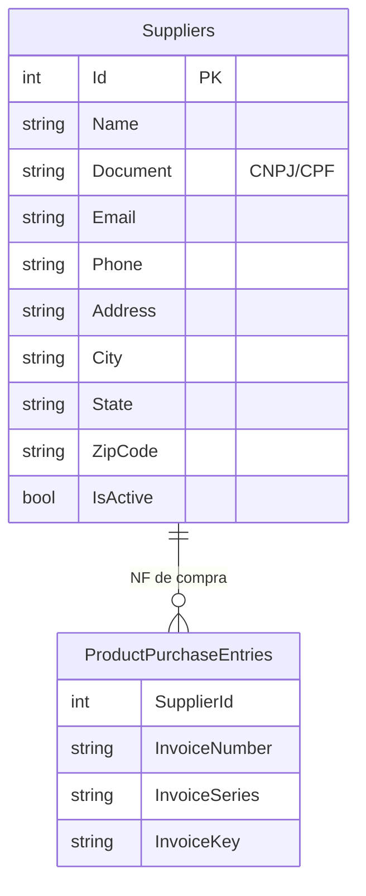

---

## Estoque

Estoque único por produto. Propostas ativas reservam virtualmente (sem alterar saldo físico).

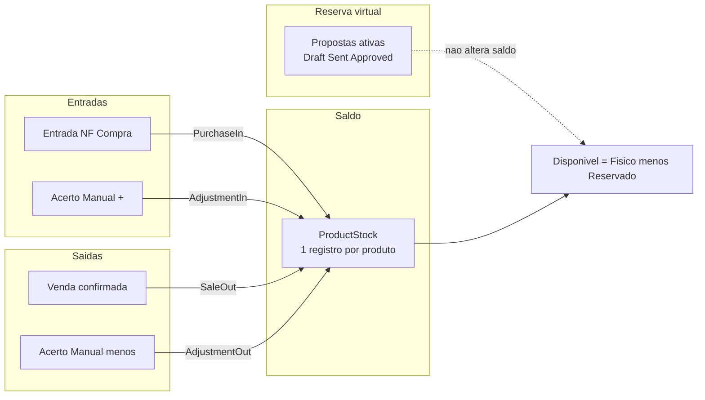

### Cálculo de disponibilidade (não persistido)

```
Reservado  = Σ ProposalItems.Quantity
             WHERE Proposal.Status IN (Draft, Sent, Approved)

Disponível = ProductStock.Quantity − Reservado

Físico     = ProductStock.Quantity
```

| Momento | Comportamento |
|---------|---------------|
| Criar/editar proposta | Alerta se `Disponível < Quantity` (`StockUnavailable = true`) |
| Converter proposta em venda | **Bloqueia** se indisponível |
| Proposta Rejected/Cancelled/Converted | Libera reserva virtual automaticamente |

### Diagrama ER — estoque (detalhe)

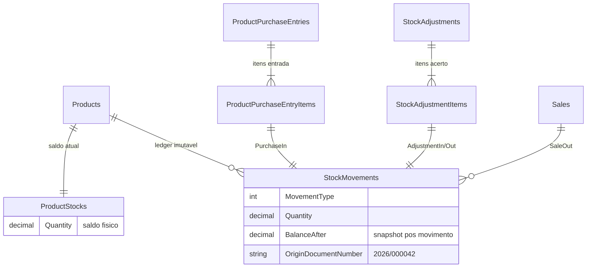

---

## Entrada NF — maior custo e markup

Entradas seguem fluxo `Draft` → `Confirmed`. **Sem cancelamento no MVP.**

O `CostPrice` do produto **não** é o custo da última NF, e sim o **maior `UnitCost`** registrado entre todas as entradas confirmadas daquele produto.

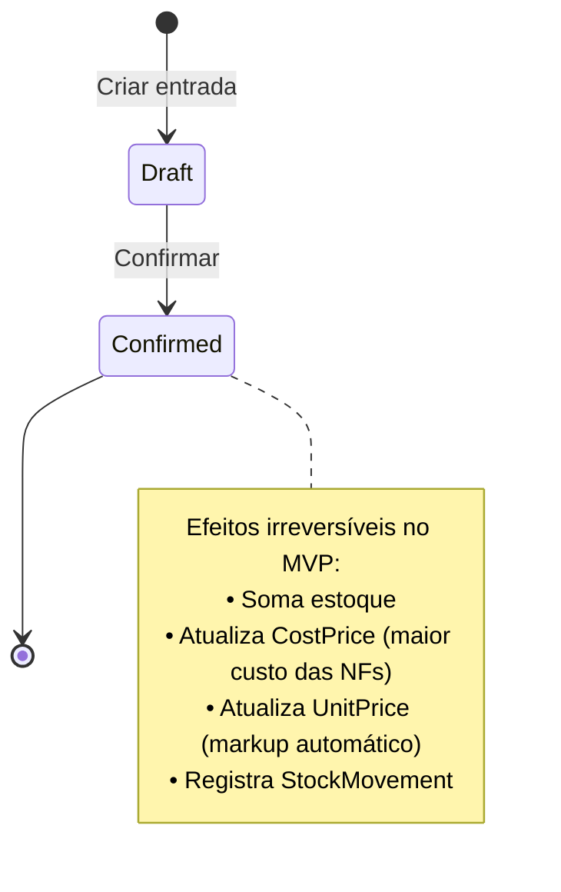

### Fluxo de confirmação

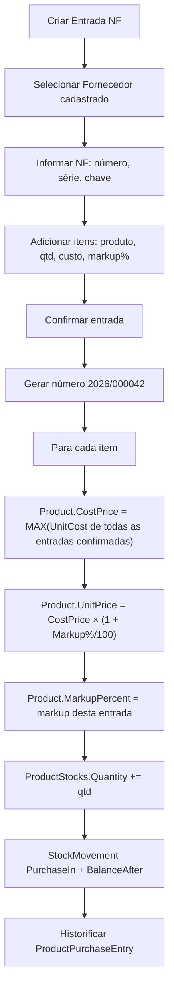

### Fórmulas

```
CostPrice                   = MAX(UnitCost) de todas as entradas NF confirmadas do produto
UnitPrice                   = CostPrice × (1 + MarkupPercent / 100)   ← atualiza produto automaticamente
CalculatedUnitPrice (item)  = UnitCost × (1 + MarkupPercent / 100)
TotalCost                   = UnitCost × Quantity
```

**Exemplo:** se o produto teve entradas com custo R$ 10,00, R$ 12,00 e R$ 9,00 → `CostPrice = R$ 12,00`, independentemente da ordem ou da NF mais recente.

### Importação XML NFe

Fluxo para dar entrada no estoque a partir de XML de NFe (layout SEFAZ 3.x/4.x). **Não substitui** a entrada manual (`POST /ProductPurchaseEntries` + `/{id}/confirm`); é um caminho alternativo com parser e matching automático.

#### Sequência (2 chamadas API)

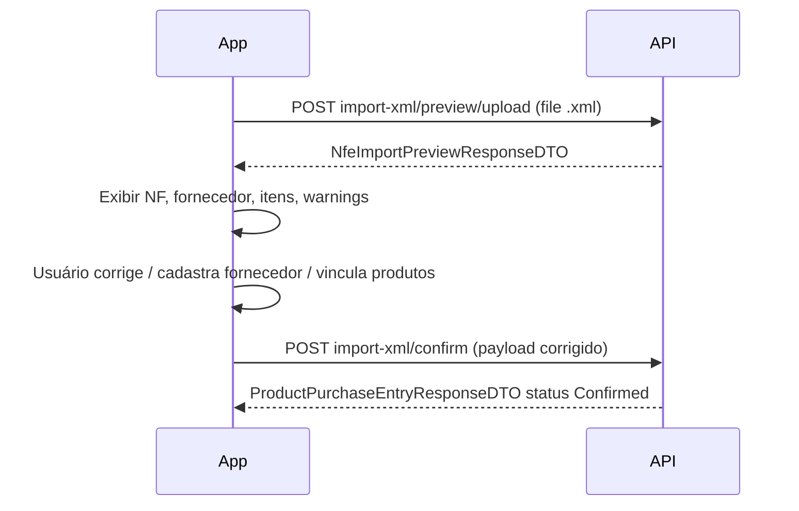

| Passo | Endpoint | Descrição |
|-------|----------|-----------|
| 1 | `POST /ProductPurchaseEntries/import-xml/preview/upload` | Upload do `.xml` (`multipart`, campo `file`) |
| 1 alt | `POST /ProductPurchaseEntries/import-xml/preview` | JSON com `xmlContent` (útil em Swagger; exige escape de aspas) |
| 2 | `POST /ProductPurchaseEntries/import-xml/confirm` | Payload com dados **já corrigidos** na tela; cria entrada e confirma em uma operação |

> O `import-xml/confirm` **não re-lê o XML**. O app envia cabeçalho + itens finais (`productId`, quantidade, custo, markup).

#### Matching automático (preview)

| Entidade | Regra |
|----------|--------|
| Fornecedor | `Supplier.Document` normalizado (só dígitos) = `emit/CNPJ` do XML |
| Produto | 1º `Product.Sku` = `det/prod/cProd`; 2º `Product.Ean` = `det/prod/cEAN` |
| Chave NFe duplicada | `warnings` + bloqueio no confirm se `InvoiceKey` já existir |

Campos extraídos do XML:

| XML | Campo sistema |
|-----|----------------|
| `ide/nNF` | `InvoiceNumber` |
| `ide/serie` | `InvoiceSeries` |
| `infNFe/@Id` ou `chNFe` | `InvoiceKey` |
| `ide/dhEmi` | `EntryDate` |
| `emit/*` | Sugestão de fornecedor |
| `det/prod/qCom` | `Quantity` |
| `det/prod/vUnCom` | `UnitCost` |

#### Campo `Product.Ean`

GTIN/EAN opcional no produto (`VARCHAR(14)`, índice único filtrado). Usado como fallback de match na importação. Script manual para tenants existentes: [`docs/sql/product-ean-column.sql`](sql/product-ean-column.sql).

#### Arquitetura do parser

- `IInvoiceXmlParser` + `NfeInvoiceXmlParser` (layout SEFAZ)
- `InvoiceXmlParserResolver` — extensível para NFSe/CTe no futuro
- `NfeImportAppService` — preview (parse + match) e confirm (delega a `CreateAndConfirmAsync`)

#### Entrada manual vs import XML

| Fluxo | Endpoints | Resultado |
|-------|-----------|-----------|
| Manual | `POST /ProductPurchaseEntries` → `POST /{id}/confirm` | Rascunho editável, depois confirma |
| XML | `preview/upload` → `import-xml/confirm` | Confirma direto (`status: 2`); irreversível |

Parser genérico (`IInvoiceXmlParser`) permite adicionar NFSe/CTe no futuro.

---

## Acerto manual de estoque

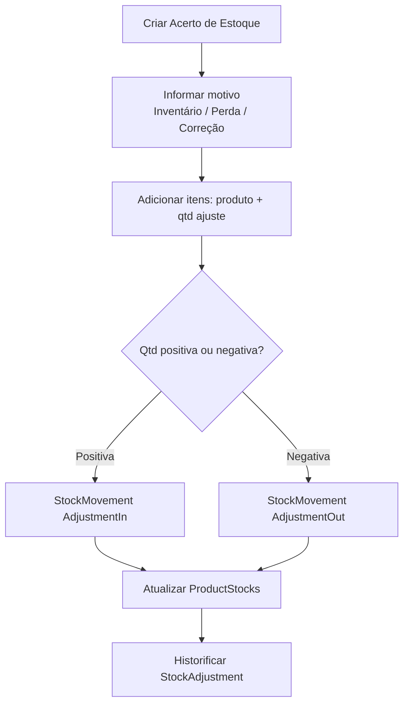

---

## Proposta e venda

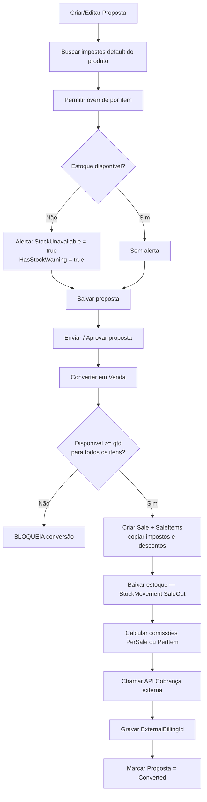

### Tipos de venda

| Valor | Descrição |
|-------|-----------|
| `Internal` | Venda interna |
| `ThirdParty` | Venda para terceiros |

---

## Descontos

Regras por JWT `role` e `email`. Na aplicação, usa o limite **mais restritivo**.

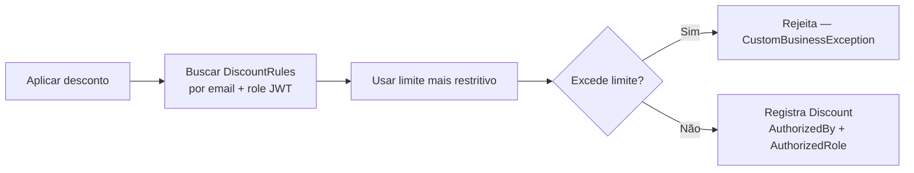

---

## Comissões

Suporta **dois modos exclusivos** por venda. O escopo é definido pela **regra global** (`ProductId = null`). Regras por produto definem **apenas o percentual**.

### Invariantes

- Escopo (`PerSale` / `PerItem`) vem **somente** da regra global
- Regras por produto definem **apenas o percentual**, não o escopo
- **Nunca** coexistem comissões `PerSale` e `PerItem` na mesma venda
- `PerItem` sem regra por produto → usa **% da regra global**
- Base de cálculo: **LineSubtotal** (com desconto, sem impostos)
- Vendedor: claim JWT `email`

### Fluxo

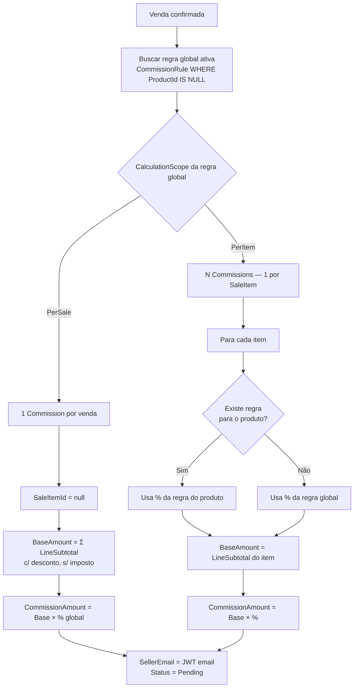

### Diagrama ER — comissão

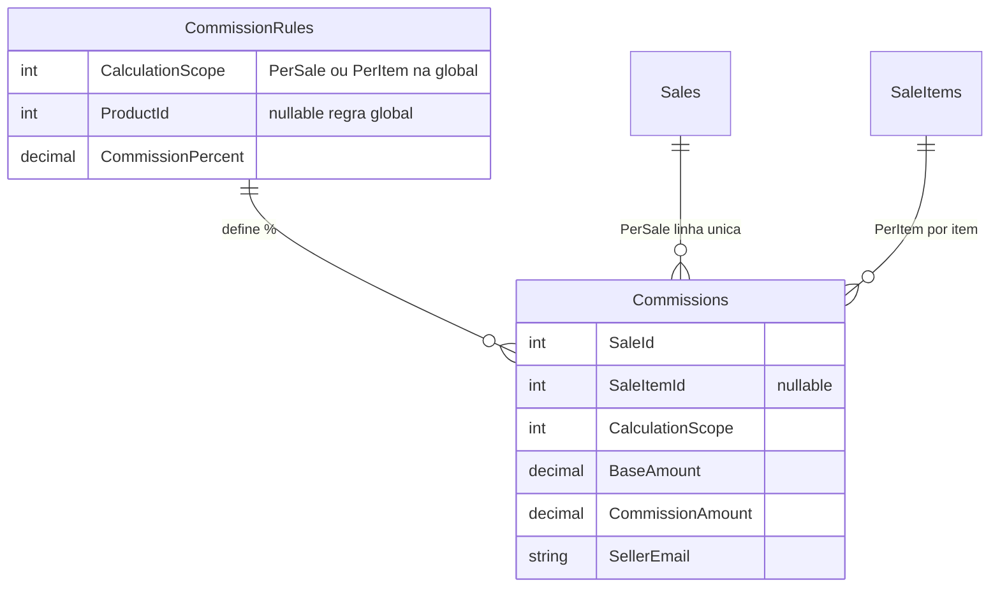

---

## Numeração de documentos

Formato: **`2026/000042`**

- Sequência por **tenant** (CNPJ)
- Sequência por **tipo de documento** (`Proposal`, `Sale`, `PurchaseEntry`, `StockAdjustment`)
- Reinicia a cada **ano**

Entidade `DocumentSequence`: `DocumentType`, `Year`, `LastNumber`.

---

## Integrações externas

Configuração em `appsettings.json`:

```json
"Domains": {
  "MaisLocacoesDomain": "https://api.maisloc.com.br"
}
```

| Integração | Método | Endpoint | Descrição |
|------------|--------|----------|-----------|
| Clientes | GET | `{MaisLocacoesDomain}/clients/{externalClientId}` | Valida cliente antes de proposta/venda |
| Cobrança | POST | `{MaisLocacoesDomain}/billings` | Gera cobrança na confirmação da venda |

Serviços: `IExternalClientService`, `IExternalBillingService` (Crosscutting.External), implementados em AppService com `HttpClient`.

**Fallback mock:** se a API externa estiver indisponível, retorna dados básicos mockados (cliente ativo / billing `MOCK-BILLING-{saleId}-{timestamp}`).

### Resposta esperada — GET cliente

```json
{
  "id": "CLIENT-001",
  "name": "Cliente Exemplo",
  "document": "00000000000000",
  "isActive": true
}
```

### Request — POST billing

```json
{
  "saleId": 1,
  "externalClientId": "CLIENT-001",
  "totalAmount": 1500.00,
  "sellerEmail": "vendedor@empresa.com",
  "saleNumber": "2026/000001"
}
```

### Resposta esperada — POST billing

```json
{
  "id": "BILLING-123",
  "status": "Pending"
}
```

---

## Mapa de módulos

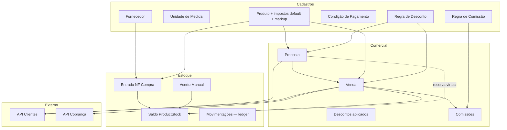

---

## Endpoints previstos

| Módulo | Endpoints |
|--------|-----------|
| Fornecedores | CRUD |
| Unidades de medida | CRUD |
| Produtos | CRUD + `GET /{id}/stock-summary` |
| Condições de pagamento | CRUD |
| Regras de desconto | CRUD |
| Regras de comissão | CRUD |
| Entrada NF | CRUD + confirmar + import XML (preview + confirm) |
| Acerto de estoque | CRUD + confirmar |
| Estoque | `GET movimentações`, `GET stock-summary` |
| Propostas | CRUD + aprovar + converter em venda |
| Vendas | GET /Sales (lista + filtros), GET /{id}, POST direta, confirmar |
| Descontos | POST aplicar, GET por documento |
| Comissões | GET por venda, PATCH status |

---

## Checklist do MVP

### Cadastros
- [ ] Unidade de medida
- [ ] Produto (impostos default, markup, custo, preço)
- [ ] Fornecedor
- [ ] Condição de pagamento
- [ ] Regra de desconto (por JWT `role` / `email`)
- [ ] Regra de comissão (global com escopo + por produto só %)

### Estoque
- [ ] Saldo único por produto
- [ ] Entrada NF (`Draft` → `Confirmed`, sem cancelamento)
- [ ] Importação XML NFe (preview upload + confirm unificado)
- [ ] Campo `Product.Ean` para match por GTIN
- [ ] Maior custo das NFs + markup automático no preço
- [ ] Acerto manual de estoque
- [ ] Ledger de movimentações (`StockMovement`)
- [ ] Reserva virtual via proposta (alerta, sem baixa física)
- [ ] Endpoint `stock-summary` (físico / reservado / disponível)

### Comercial
- [ ] Proposta (alerta estoque, bloqueio só na conversão)
- [ ] Venda (Interna / Terceiros)
- [ ] Conversão proposta → venda
- [ ] Descontos com auditoria JWT
- [ ] Comissão `PerSale` ou `PerItem` (exclusivo por venda)
- [ ] Impostos editáveis por item (default do produto)
- [ ] Numeração `2026/000042` por tenant/ano/tipo

### Integrações externas
- [ ] Clientes via API externa (`ExternalClientId`)
- [ ] Cobrança via API externa (`ExternalBillingId`)

---

## Fora do MVP

- Cancelamento de venda
- Cancelamento de entrada NF
- Multi-depósito / multi-estoque
- Estorno automático de cobrança
- API externa de fornecedores (cadastro interno no MVP)

---

## Referência de arquitetura

Este microserviço deve seguir o padrão vertical slice do `Test` no BackendTemplate:

| Camada | Artefato |
|--------|----------|
| `Domain/Entity/` | Entidades + enums em `Crosscutting/Enum/` |
| `Infrastructure/` | Repositories, DbSets, Fluent API |
| `Crosscutting/DTO/` | DTOs por recurso |
| `AppService/` | AppServices + AutoMapper profiles |
| `API/Controllers/` | Controllers REST |
| `Migrations/` | FluentMigrator por grupo de tabelas |

Convenções de nomenclatura: `{Name}Entity`, `I{Name}Repository`, `{Name}AppService`, `{Name}sController`, tabelas no plural PascalCase, migrations `Mig_{timestamp}_{Name}`.

---

## Documentação relacionada

| Documento | Conteúdo |
|-----------|----------|
| [`api-reference-sales-mvp.md`](api-reference-sales-mvp.md) | Catálogo completo de APIs, DTOs, enums, integrações externas e sequências de fluxo |
| [`flutter-ui-spec.md`](flutter-ui-spec.md) | Especificação de telas Flutter (mobile + web) |
| [`postman/Sales-MVP-Full-Flow.postman_collection.json`](postman/Sales-MVP-Full-Flow.postman_collection.json) | Collection Postman com fluxo E2E |
| [`sql/product-ean-column.sql`](sql/product-ean-column.sql) | Script PostgreSQL — coluna `Product.Ean` em tenants existentes |
